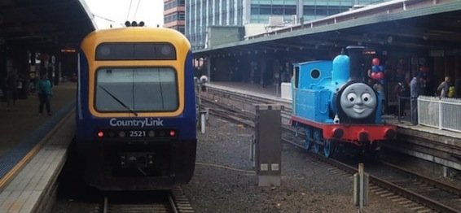

So it seems that Thomas the Tank Engine is in Sydney Central station. My good friend [Clara, blogged about it](http://kirinyan.net/photoblog-2013-08-13-railway-tracks-to-the-past/) and she even had a video of the opening theme. Since we didn't really have this show on TV when I was a kid, or maybe we did I just haven't seen it, I can't relate that well to my friends who are nostalgic about this. I do however know the story and premise.

So why make this post? Well, after listening to the OP again, it reminded me of a certain YouTube video. If you have seen the anime _[Steins;Gate](http://myanimelist.net/anime/9253/Steins;Gate)_ then you would know that in ep 16 or so (maybe earlier, I don't really remember) Mayushii and Okabe are in the subway at Akiba and then ......

**\* CAUTION SPOILERS! CONTINUE ONLY IF YOU HAVE SEEN THE ANIME \***

---

<iframe src="//www.youtube.com/embed/SIbBKpZWabQ" height="315" width="560" allowfullscreen frameborder="0"></iframe>
