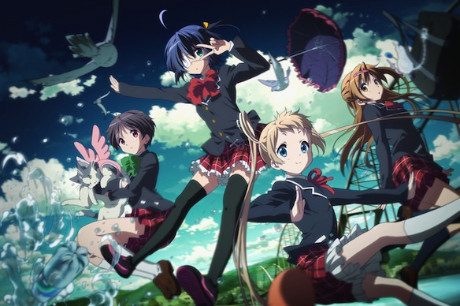
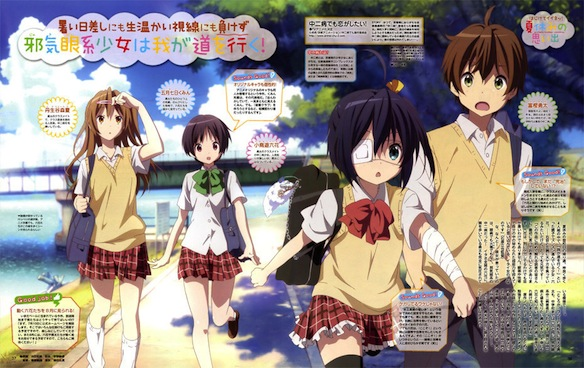
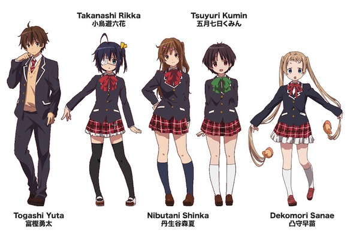
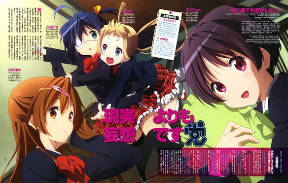

**\*\*\*\*\*\*\*\*\* CAUTION SPOILERS\*\*\*\*\*\*\*\*\*\*\***

When I initially saw the preview for this show ([Chu2](http://myanimelist.net/anime/14741/Chuunibyou_demo_Koi_ga_Shitai!/ 'MAL')) I though: "Hmmm Kyoto Animation (KyoAni) is making a action anime with super national battles?! Woah!" And then upon watching the first episode I realized: "nope, no action here, just cute girls doing cute things". But boooooy was I off the bat with that!<!--more-->

If I could sum this 13 episode series up in a few words, it would be: moe, comedy, drama, & DEATH.

Main girl, Rikka, is "suffering" from a syndrome known in Japan as Chuunibyou (8th grader syndrome). Basically she imagines that she is a mage with awesome powers and that she can fight the evil demons with swords and guns. The main guy character (MC), Yuuta, also used to suffer from chuunibyou, but has gotten over it and it makes him very embarrassed to remember the stuff he used to do when he was in middle school. There are some more characters like Dekomori, servant of Rikka, 2 years younger and always says DEATH at the end of the sentences instead of desu~. Also Deko is known for her thin but long twintails which she likes to twirl (imitating a spinning hammer). Then there is Kumin (pillow-senpai), who loves falling asleep at random times, and who is as pure as unicorn; she even wears white all the time! Then there is mandatory KyoAni sidekick (Makoto) to the MC, basically if you have seen Clannad or Hyouka, you'll know what I'm talking about. And of course the b\*\*\*\* queen Nibutani Shinka (former chunibyou MoriSummer); this girl was the favorite of most people, then we found out about her dark side and it went downhill from there for most, me as well (not everyone though, my friend Tac still loves here to this day!).

Its very hard to get the balance between comedy and drama well, but KyoAni did an amazing job with this series. Each episode kept the viewers on their tows and we were always screaming for more. Up to episode 5 or so we had no idea that this show had a dark side…. And then shit got real! What was very unexpected of KyoAni: an actual love confession! I thought their pureness limit wouldn't allow them to go further then holding hands, but OMG there might even be a kiss scene in the upcoming OVA. Lest see how the OVA turns out, and if it exceeds my expectations, this show might be my favorite of 2012. But generally its a very good show made by one of the best anime companies out there, KyoAni.

**9/10.**

