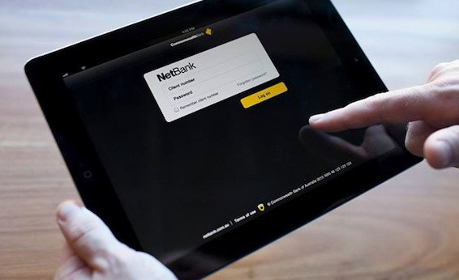

Last week I was contacted by a marketing research organization on behalf of [Commonwealth Bank](https://www.commbank.com.au "Commonwealth Bank") in regards to their iOS mobile banking app. Basically its a focus group where they showed up slides of the new software and asked us questions about how we feel when seeing these new features. It sounded like an interesting thing to do on a Thursday evening, especially cause they gave me $80!

<!--more-->

At first we were shown slides of a notification screen and an email that will be posted/sent out to all customers using their current iOS app to notify them of the amazing new update. I was a bit skeptical at that point, because they really don't need to do that, since iOS7 will have automatic updates enabled by default.

But then everything changed when the fire nation attacked, they showed us a prototype of the new app. Woah, it looked nice. All my worries that it wont  fit the new iOS7 interface and general feel were gone. It was perfect, the developers have done a great job, the buttons matched the iOS7 buttons, the home screen had a blur, same as most parts of iOS7. The new features looked good, and they have updated the old features, like doing a quick transfer between your own accounts is much faster and easier.

Its is a very welcome update, and I can see that they are on the right track, hopefully they can release it in the first days of iOS7, cause a lot of people were a bit pissed off when it took Commonwealth 2 months to update the NetBank app for iPhone 5.

I would love to write up more about it, but I can not disclose any more information about the new features or serious improvements. We will just have to wait and see when it comes out.
