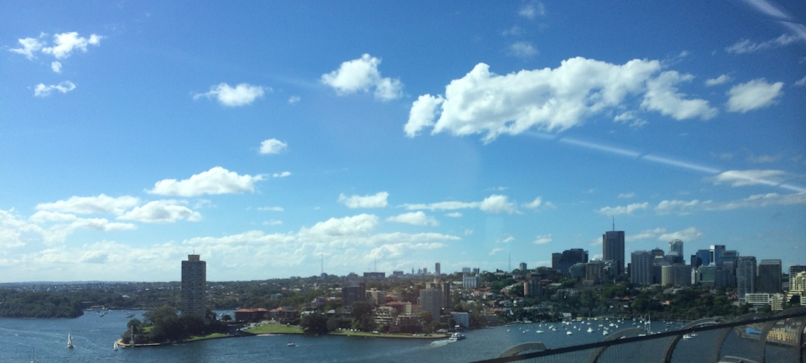
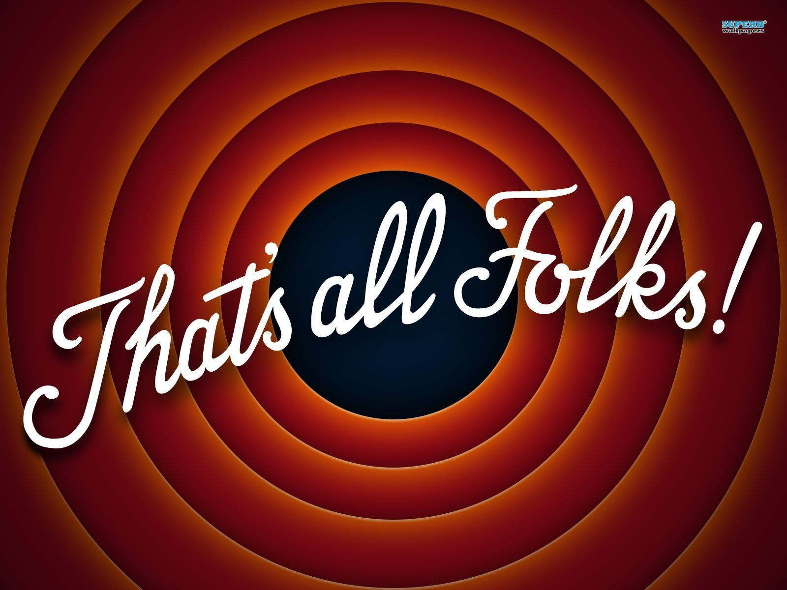

My friend [Sebastian](http://alonelyseptember.org) mentioned me in a tweet saying that I should also write up a post describing my blog life. After a week or so of contemplating, I decided why the hell not.

**When did you first start blogging and why?**

My first blog post dates back to May 20th 2012, however I did write up a few anime reviews on my Google+ account, which I later on transferred here so that people can read. Why? .... hmmmm I guess because In the first year of uni I meat [Ruben](http://rubenerd.com) and he showed me his awesome blog. Ruben is my sempai and I respect him a lot, in him I saw someone who I wanted to be when I was his age (IT wise), and so I started little by little - from making a blog to writing small apps as a hobby.

---

**Have you had any past online presence?**

Facebook yes, a bit of Google+, YouTube comments?... Otherwise not really, I was not the type of person who would voice their opinions on the internet. I think that has changed a bit over the years.

**When did you become serious about your blog?**

I don't think I am at that stage. I post about my travels, mainly for my family to see; I post about anime, games or IT stuff cause I find it interesting; I post about interesting experiences and things that I think other people would find either amusing or intriguing.

**What was your first blog post?**

This little baby right here: [Japanese App](/posts/2012/japanese-app-update-first-blog-post/). It was a quick thought about the update of my favorite japanese app for iPhone (and now iPad). Nothing special, but I will always look back to it, because it was my first!

**What have been your biggest challenges blogging?**

Aside from the language (engrish no my first language, hard, very), I would say finding content that people want to read about, not only personal experiences but also some things that people might not know of and would have an interest in. Thats why I sometimes blog in Russian and Japanese, to expand my readers base. And when I go to japan next year I am pretty sure a lot of my friends there will want to read my posts.

**What is the most rewarding thing about blogging?**

If someone asks you about something and you have written a lengthy post about it, you can give them an overview of your opinion and then send them to your blog for more info. Very convenient. Also it makes it so much easier to share your travel experiences with friends and family.

**What is the most discouraging thing about blogging?**

I don't mind not getting comments on my blog, heck I removed them, people can always talk to me over Twitter or Facebook. To me the most discouraging thing is actually sitting down and writing up a post. I want it to be good, look nice, and have meaningful content. That is really time consuming. And time is not something I can freely waste at this point in my life.

**What is your lasting inspiration or motivation?**

I know having a blog which you manage yourself, designed yourself, wrote the code yourself (aside form the WordPress part), and host yourself on a bought domain & you know how it all works, is very good for anyone aiming for a career in IT.

**What is your blogging dirty little secret?**

In the first year when I started blogging I accidentally set up my blog on wordpress.com instead of wordpress.org and was wondering why can't I edit the html and can only slightly modify the CSS. Wasted a good 90$ (fee for the special package for the year) on that, before finally moving to a self hosted domain (where we are now).

**What is your current goal as a blogger?**

To write long and meaningful posts that would interest other people as much as they interest me!

**Have you learned or become passionate about anything through blogging that caught you by surprise?**

I don't know if it was because of blogging or my uni classes, or Apple, or urbanest, or Ruben, or my friends who study visual communications, but I got obsessed by good design and fonts. Designing beautiful and minimalistic user interfaces is my passion now. Not only UIs to be honest, for urbanest I make forms, posters, and signs which I also pour my heart and soul into. That being said, expect this blog to drastically change by Christmas, into something that I can proudly call my art.

