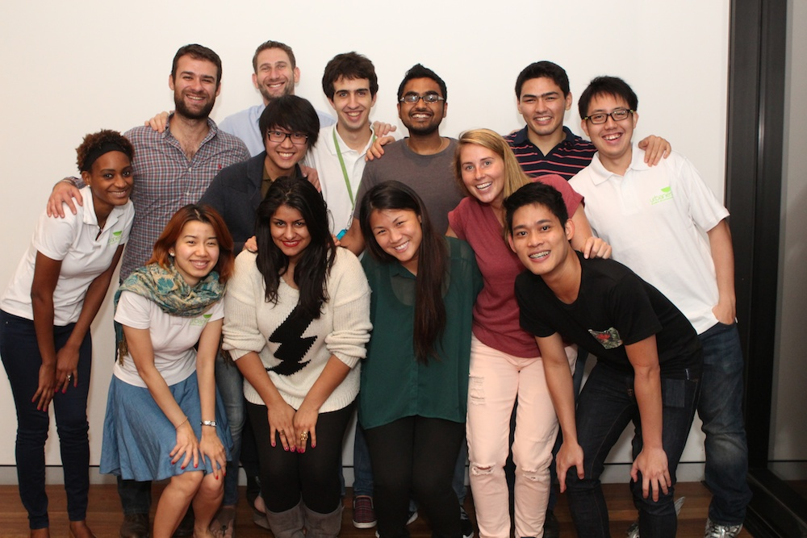

All good things come to an end. Like, for example, calling people up and making bookings, checking new residents in, and welcoming new staff to the team. There comes a time when we must part with the ones who have become and unforgettable part of this small group who help function the system that is urba**nest** Quay Street, the ones who we call family. Of course I am talking about our beloved Community Netwokers - Wilmer and Megan. They are finishing their degrees at university and they are either going back to their home countries or seeking other future prospects. Both of you will be greatly missed, you have truly become part of the family and we can not imagine life at urba**nest** without you.

To celebrate the building being full for semester 2 of 2013 and to bid farewell to 2 members of you big family we held a dinner. Nothing classy, just the TV room, some food and a cake! Overall it was a very pleasant dinner, and we will all miss you guys! Please visit once in a while, or at least message us!!!!

Here are some photos from the night, most taken by our new Community Networker - [Darrell](http://twitter.com/ietoshi):

