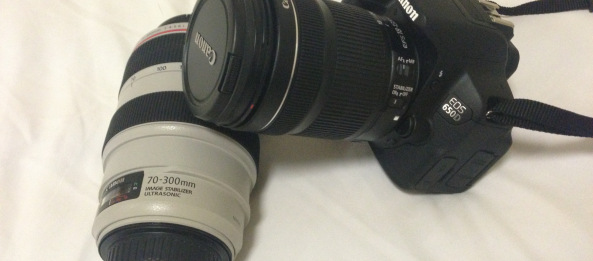

My dad was teasing me for a few months now, showing off the new telephoto lens he bought for a few thousand 4 months ago. Then at some point I told him that putting that amazing new lens on our 6 year old camera is like installing 64GB of RAM into a machine with pentium 3.... So apparently he listened to what I was saying and got me this baby for my birthday: Canon EOS650D! All the photos of our trip to Melbourne and Fiji will be take using this new device. Stay tuned for some amazing photos
