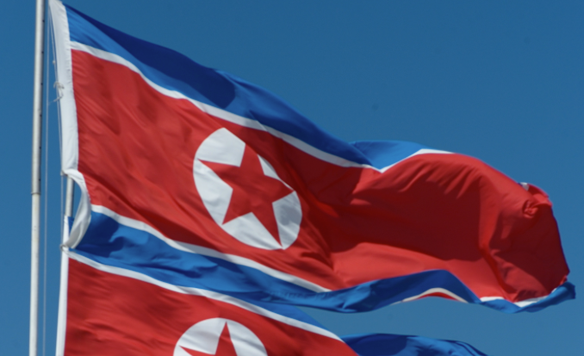
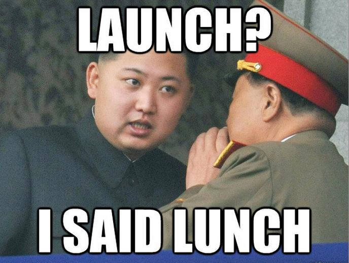

There has been a lot of new going around about the DPRK and a potential occurance of World War III lately. I don't know much about North Korea aside from jokes on the internet about Kim Jong Un like this one:<!--more-->

I was very curious about the situation there now, but I never actually bothered to research anything about the country. Heck, there isn't that much information available about the DPRK anyway. But anyway, today when I went to the friendly bay where all the pirates chill, they had a YouTube video on their homepage. The video was about the DRPK. Apparently this guy from the USA went there for holiday and got "permission" to film and take pictures there, but under very very very strict conditions. But he still managed to pull off an amazing documentary of his trip and raise the curtain a little bit for us westerners who want to find out more about that closed country.

Being born right after the fall of the Soviet Union, I did not get to experience this kind of thing first hand, but have heard multiple stories from my grandparents and parents who lived their whole lives in that regime. I can say that North Korea is exactly what I picture the USSR to be like back in the day. In a way I wish I could have experienced that for at least a little bit, but truth be told, living now is much much easier then it was during those days.

Here is the video:

<iframe src="http://www.youtube.com/embed/oULO3i5Xra0" height="315" width="560" allowfullscreen frameborder="0"></iframe>
