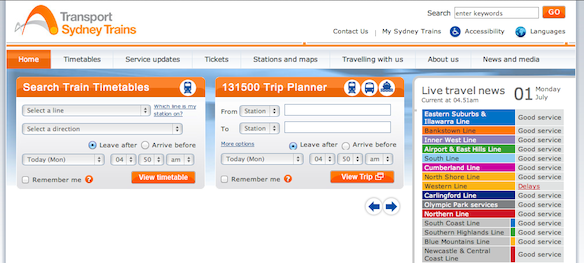

This afternoon (night in Sydney) my friends were complaining about another change in their daily life. This time it was the [CityRail website](http://web.archive.org/web/20130601172447/http://cityrail.info/). According to Wikipedia: "[CityRail](http://en.wikipedia.org/wiki/CityRail) ceased trading on 30 June 2013 and was replaced by [Sydney Trains](http://en.wikipedia.org/wiki/Sydney_Trains 'Sydney Trains') and [NSW TrainLink](http://en.wikipedia.org/wiki/NSW_TrainLink 'NSW TrainLink')." Which of course means that the website had to be redesigned as well with the new company logo and new colors. I personally don't mid the new orange color scheme , they only changed the color itself but not the gradient. I wish they would get rid of that 3Dish look of the buttons and headers of the timetables and trip planer. But oh well I can't really complain.

---

People don't like change, it doesn't really matter if the change is to the best or worst, but its done, get used to it. In this case, they didnt change the functionality, they only changed the color scheme and the logo, so really its not that big of a deal.

Also what my good friend [Cindy](http://twitter.com/adasifs) said on twitter: "It's the reason why they had to do trackwork - website revamps". If this is true, god bless Australia.

