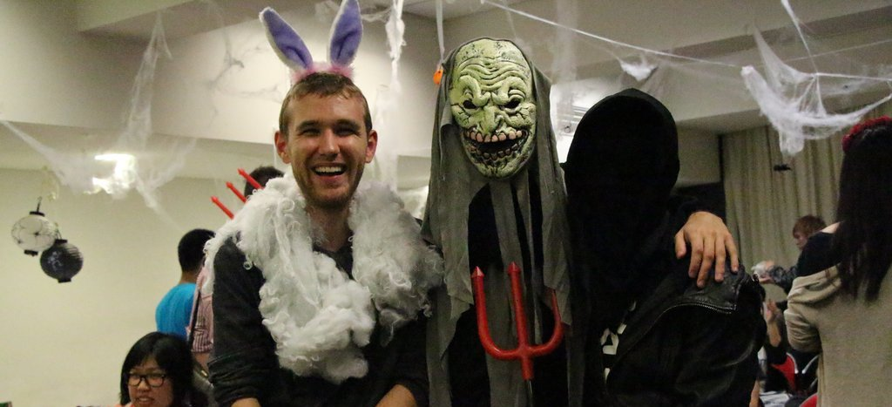

Tonight, just a few days before Halloween itself, Anime@UTS & JASS held its first ever horror movie screening! With around 40-60 people there, I would say that this event was a huge success.

---

For food there ware cupcakes, candy and pizza. Movies we watched were _Ju-on the course_ and *The Ring.* Thats some pretty scary stuff right there, so I didn't watch, cause I am really bad with horror movies.

Here are some photos of the event, most taken by [Sebasu_tan](http://alonelyseptember.org):

https://imgur.com/a/0uQIf
