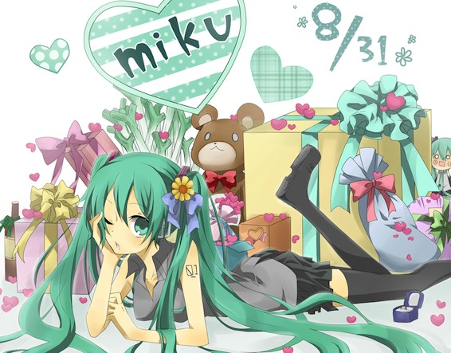

Happy birthday to my favorite virtual idol Hatsune Miku! You were born exactly 6 years ago, but for all of us you will forever be 16 years old ^\_^ You can also read the congratulations from my friends [Ruben](http://rubenerd.com/happy-birthday-miku/) and [Clara](http://kirinyan.net/another-miku-birthday-and-vocaloid-english-v3/) on their blogs.

On a side note, there has been news recently of the new english voice bank for Miku in Vocaloid V3. Its sounds rather good, still feels a bit weird to hear Miku speak english though.

To learn more about it you can go to the [Vocaliod Wiki](http://vocaloid.wikia.com/wiki/Hatsune_Miku_V3_English), or listen to a song on [YouTube](http://www.youtube.com/watch?v=xuUHksO-Qdw).
