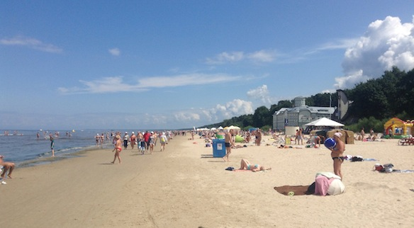

ラトビアと言えばやっぱり[ユールマラ](http://ja.wikipedia.org/wiki/ユールマラ)だな〜  Ja tu gribi kaut kur atpūsties tad brauc uz jūru, uz Jūrmalu! Солнце, пляж - отдыхай, плавай, загорай.

Jūrmala is a small city on the coast line 20km away from the capital Rīga. Its like Goal Coast in a way, nice beaches, lots of people and a lot of attractions. I went there with my family and our family friends just for a stroll and to spend the nice day outside at the beach.

Here are some pics on my 
