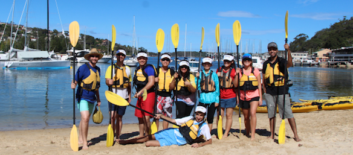

Here at urbanest Quay Street we have 4 and 6 bedroom apartments where everyone gets their own en-suit room and you share the kitchen and living room area with your flatmates. Book now we only have a few rooms left!!! ....

NOooooooooooooT! We are full! And have been for a while. And this is all thanks to our amazing team, who put a lot of effort into making bookings and filling up the building. But of course no good deed goes unrewarded. So we are all going KAYAKING together!

---

It was raining the whole week in Sydney, but specially just for today the weather cleared up and it was a nice and sunny day for us to enjoy our BBQ and kayaking (it did rain a bit though, but it stopped after 10 minutes). We had a lot of good food cooked on the BBQ (_barby_) and some pavlova cake for desert. After filling our tummies with delicious food, it was finally time to hit the waves! (in a way)

Kayaking was a lot of fun, but also very tiring (yea I am weak, I know). I don't know how much of a distance we covered, but it felt like a lot. I think we were in the water for about 2 hours or so. But I would love to do it again!

Link to photo album:

