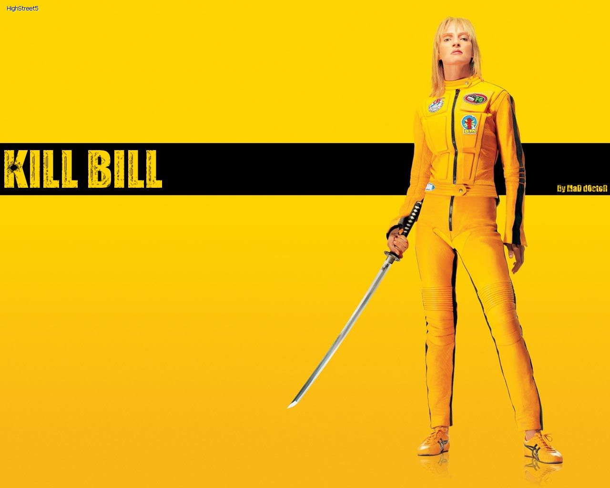

Why have I not seen this movie up until now? Its a [Quentin Tarantino](http://en.wikipedia.org/wiki/Quentin_Tarantino) movie, yet I have just watched it last week! Well, to be honest, I haven't seen any of his other movies, but I have heard very good things about them and some people even say that he is a genius when it comes to film making. There is no reason why it took me so long to watch [Kill Bill](http://www.imdb.com/title/tt0266697/ "Kill Bill IMDB"), but I am grateful to [German](http://twitter.com/gexgrino) for making me watch it (just like that: "we are watching this movie now, no buts!"). I will just give a brief overview of the show and wont get into much detail, so there will be no spoilers.

<!--more-->

**The story** revolves around the main character \*\*\*\*\* (played by Uma Thurman) who was supposed to be killed along her friends and fiancée during their 'wedding'. She wakes up 4 years later after a coma and is seeking revenge. Then we slowly learn of her story, and also how and why this whole "incident" happened.

Why is this show so amazing? Of course the plot - it is easy to follow, and all makes sense in the end. Then the actors - wow, just wow, all the actors preformed magnificently, I think even some won an Oscar for their acting. And of course Tarantinos crazy story telling techniques and camera angles. Heck a good 15 minutes of the first Kill Bill was made as an anime and then another 20 or so minutes were in black and white. As most of his other movies this one had a lot of killing, blood and pure violence which is just so much fun to watch. Another aspect of these movies that I really loved was that when the action was happening in Japan, the actors who played the yakuza were actual japanese actors who I have seen in japan made yakuza movies and they were speaking proper japanese. Same goes for the old Chinese guy.

Overall it is a great movie, which I would recommend everyone to watch.

Going into my list of all time favorites alongside [Shawshank Redemption](http://www.imdb.com/title/tt0111161/ "Shawshank Redemption IMDB") and [V for Vendetta](http://www.imdb.com/title/tt0434409/ "V for Vendetta IMDB").

10/10
