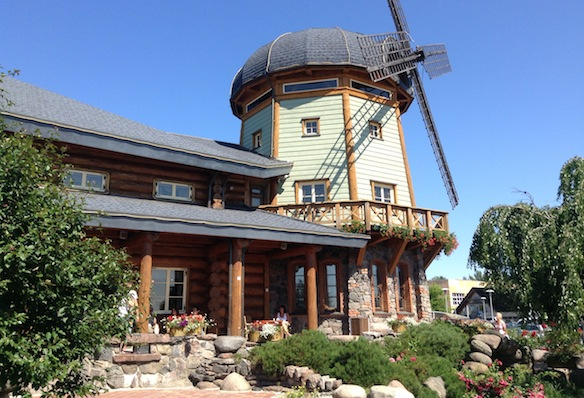

For lunch today my parents took me to Lido. Lido is a restaurant and a small amusement center located 10 minutes away from the center of Riga. Not only does it look like a building from the countryside of Latvia, but the food there is also traditional and specific to the more rural regions of Latvia. And of course it is extremely delicious!

---

The atmosphere both outside and inside is very calm and beautiful. Plus since the song and dance festival of Latvia is happening right now, everything has more traditional themes then usual. And there was a group from the city Rezekne who was singing some folk songs and tunes, here is a video:

https://www.youtube.com/watch?v=Or1x7NlOwVc

Album with photos (scroll half way):

