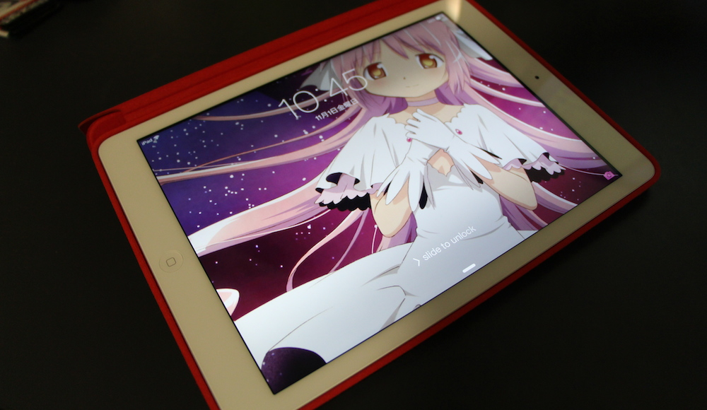

Every year Apple releases an update for their iPad lineup. This year they created something incredible, something that redefines how we use tablets (again) - the iPad Air. If before, the 9.7' iPads were heavy and bulky, so much that you would have to chose to take that or your laptop to uni or work, with the iPad Air that is no longer an issue. It is lighter and thiner. So much lighter, I might add, that I feel as if I am holding an iPad mini in my hand. The design of the back mimics the design of the mini and feels really nice in your hands. By making it lighter and thiner, holding the iPad Air in one hand feels comfortable and natural. Anyway I love it. I finally have an iPad that I can call my own, and I will be using it mainly for entertainment, but also sometimes for uni and stuff. I am pretty sure that my mom is very jealous of this device as her main complaint about her iPad (iRin) is that it is too heavy.

If you follow my blog you [would know](http://jamiejakov.lv/games/stand-in-all-the-lines-buy-all-the-things/) that last month I stood in line for like 4 hours to get an iPhone 5s , which I named iShinobu. This time I only waited for like 10-15 minutes and got the iPad Air straight away, very nice. And if you know anything about anime, you can guess what I named this amazing new gadget: iMadoka ( *[Mahou Shoujo Madoka★Magica](http://anilist.co/anime/9756/Mahou-Shoujo-Madoka9733Magica)* )

In [this flickr set](http://www.flickr.com/photos/jamiejakov/sets/72157633597403918/) I have some photos of the figure of Godoka (ultimate form of Madoka), so take a look there.
