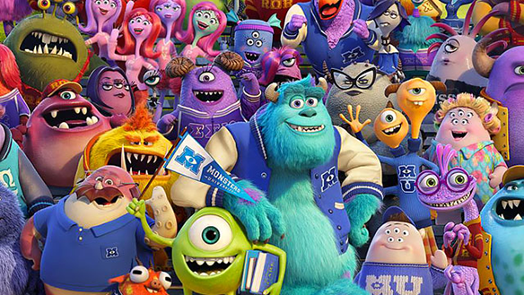

Hey, have you heard? There is a new movie out by Pixar called Monsters University! Yea that right its a prequel to Monsters Inc. Why am I telling you this? Well today is the day it got screened in Australia and I went to watch it with [Saya](http://twitter.com/KSnpy).

---

Its everything you would expect from Pixar. Stunning animation, amazing voice acting, funny jokes all around and of course characters you just love. The story is set before Mike and Sully went to work at Monsters Inc. as scarers, its set at the university where they got their education, \*cough\* well kinda, and one might say thats the period when they had the best time of their lives.

Since I am a university student now, not in America though, I can relate to most of the jokes and funny moments of this show. Like seriously when I was given the orientation in my first semester uni seemed like such a bright and happy place, but alas that was a mask hiding the horrors of education within.

This movie is about effort, its about overcoming everyones expectations and showing what you can truly achieve, it is about the values of teamwork and friendship, and of course about being smart and finding your way out of any sticky situation.

As I have seen all of Pixars wonderful movies over the years, they have set a very high standard for themselves, so I can not say that this is their best movie, it is a very very very good one though (as are all of their movies). I don't really rate movies, but if I had to, I would give it probably an **8/10.**

Trailer:

<iframe src="http://www.youtube.com/embed/ODePHkWSg-U" height="315" width="560" allowfullscreen frameborder="0"></iframe>
