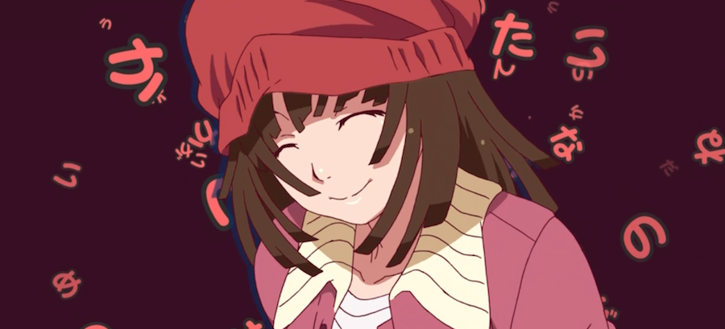

Each of their shows is filled with character development, engaging dialogue, thought provoking themes, deep plot, intelligent humor, symbolism ([meanwhile at shaft](http://i.imgur.com/ApGFIRk.jpg)).

This seasons _Monogatari series_ _second season_ is no exception. If you guys remember [_Bakemonogatari_](http://myanimelist.net/anime/5081/Bakemonogatari) - Nadeko Snake ark and the ever so famous OP - Renai Circulation, then you will be pleased to hear the in this seasons monogatari Nadeko has her own ark and a new OP to match it!

---

Here is a link to [Renai Circulation](http://www.youtube.com/watch?v=VmQQoCK6hFs) (RC), and here is the new OP called Mousou Express (ME):

<iframe src="//player.vimeo.com/video/75389095" width="500" height="281" frameborder="0" allowfullscreen="allowfullscreen"></iframe>

[Doki Doki](http://fekete-rigo.tumblr.com/post/61971310330)

I would like to [compare the two](http://imgur.com/a/OrlMz#0). In RC we can see that Nadeko is all cheerful and looking forward to seeing her beloved Koyomi-oniichan, she is trying hard with her studies and going forward in her life in a skipping pace. In ME its the exact opposite. To be honest Shaft just reused some parts form RC but played them backwards, but it does convey a message. She has regressed, she has fallen into a dark state of boredom a slight depression. She can't be bothered studying or working hard; "excuses and reasons are just to bothersome, because its fate there is no helping it" - she sings. She just wants everything everything everything everything. Her childish and selfish side has shown itself and that is what this ark is all about (kinda, no spoilers).

З.Ы.: Originally made for the [Anime@UTS Music Monday post](http://utsanime.net/2013/09/music-monday-based-shaft/).
