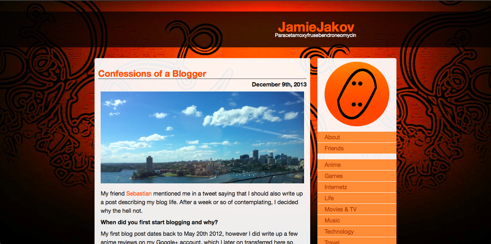
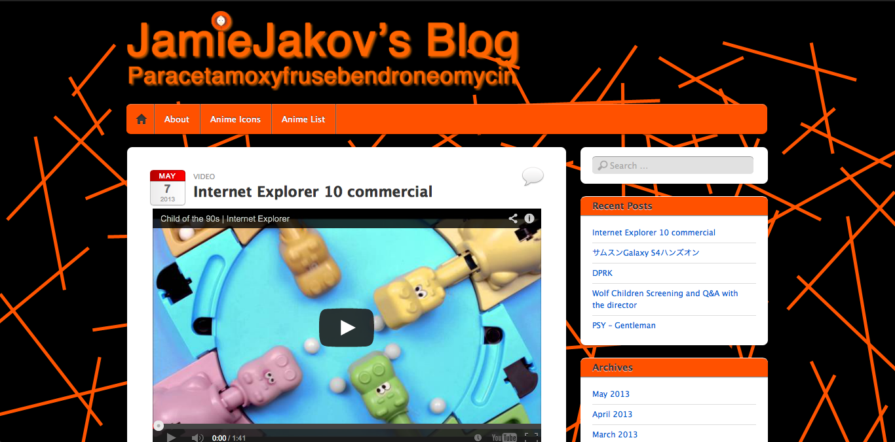
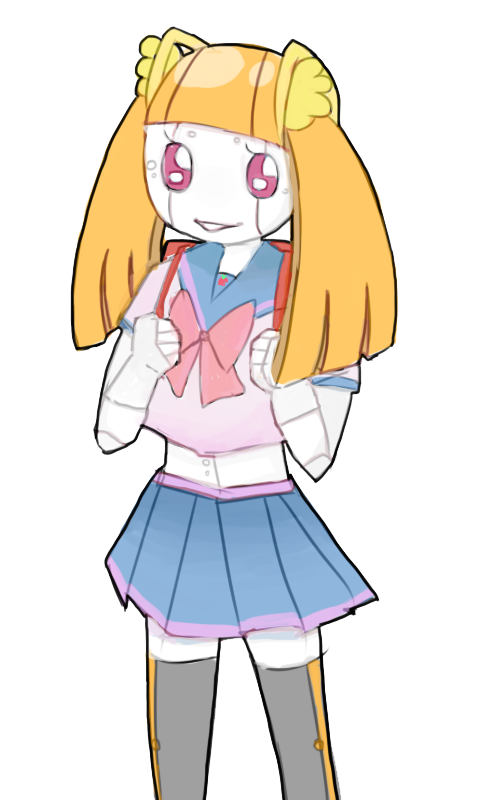
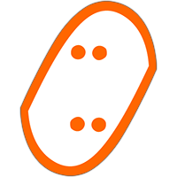
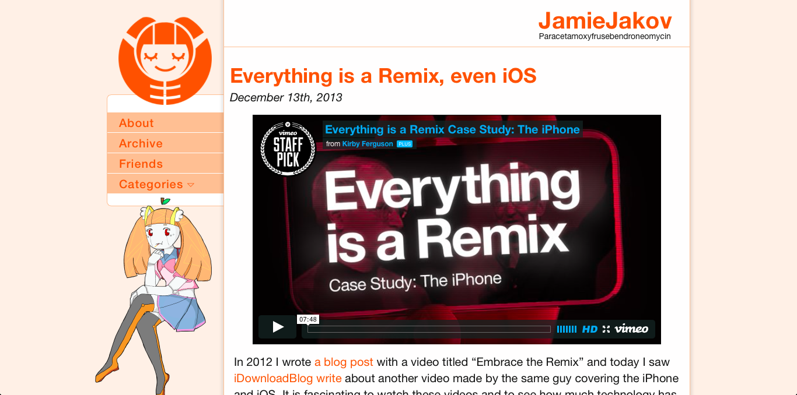

I have had my blog for a year and a half now, [first post](http://jamiejakov.lv/technology/japanese-app-update-first-blog-post/) being on the 20th of May 2012. In this time I have managed to change web hosts and themes. Now I believe is the perfect time to improve the design I have been using ever since I moved from wordpress.com to private web hosting - Wild Flower. Today, on the 25th of December, I would like to present my new blog theme **Ring-O.**

---But before I go into more detail about the style I would like to take a trip down memory lane and talk about the previous designs I was using. First was when I was still using jamiejakov.com hosted on wordpress.com. The theme is called [iTheme2](http://theme.wordpress.com/themes/itheme2/) and it is a free theme on wordpress.com. With a few slight modifications I made it my own.

I couldn't do more then these slight color and background changes as those are the limitations of having a wordpress.com blog. Being annoyed that I couldn't do anything to my _own_ blog, I decided to get my own domain and web hosting. At the time I was doing it was the end of my Spring semester of 2013, so I was pretty busy with assignments and didn't have much time to sit there and design a theme. I chose a dark theme (which you see on the top of this post) called [Wild Fire](http://www.s2webdesign.com/wild-flower.html). I have been using it for ever since. Slight modifications to the CSS and it was good to go. I did rewrite the CSS at one point, but still kept the overall design the same.

Now its time for a change! With an amazing artist on board I knew I could finally visualize my perfect blog theme. I sat there hacking away at code for the past few weeks thinking of the best possible positioning of each element, of each image, of each border. Finally when I was happy with layout and everything I gave the task of designing the new logo, all the headers/background images and a mascot (no I am not copying [Rubenerd](http://rubenerd.com)) to my girlfriend at the time - [Amy](http://twitter.com/dekopatchi). She came up with the concept of my new mascot, named Ringo, and focused all the other design decisions around her.

 Here she is! Continuing on with the design decisions. The logo was completely redesigned but it kept the original idea in mind. The original concept for my old logo was that the 2 letters J were written in Japanese with じ and they were mirrored and flipped to make this oval with points inside. She did that by making Ringo's twin-tails into じ so that they are facing each other!

Continuing on, All the pages were rethought and drawings done by Amy were added. In the About page a whole new category was added - Social Media. That gives a glimpse of all the social media Apps that I use, making it easy to find me. The Categories page was created to give my readers (you, yes you) an easier way to see what each category entails and an convenient way to browse all my posts. The layout of the index page as well as the page navigation was changed, the color scheme was altered to remove black as much possible, making the theme light and fluid. Also a very important decision was to remove the categories from the sidebar and make them a dropdown. Not only does that save space, but it allowed me to put Ringo-chan there and set the sidebar to a fixed position.

And the main new feature of my blog is responsive design! Now it looks amazing on both 9.7' iPads and 4' iPhones (and all the Androids in between). Take a look!

