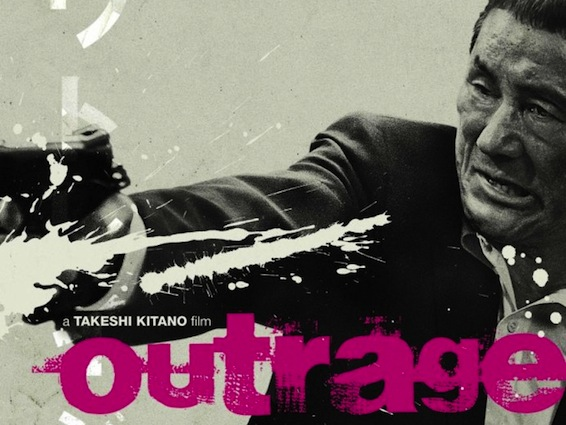

One of the most famous parts of the japanese culture are the japanese gangsters or as they are called in the land of nippon: Yakuza ([ヤクザ](http://en.wikipedia.org/wiki/Yakuza)). Takeshi Kitano directed the film [Outrage](<http://en.wikipedia.org/wiki/Outrage_(2010_film)>) and its sequel Outrage Beyond, which portray the life of members of a large organized crime syndicate - Sanno-kai led by Grand Yakuza leader Sekiuchi. [Takeshi Kitano](http://www.imdb.com/name/nm0001429/?ref_=tt_ov_wr) not only directed both movies he also stared in both as one of the main characters - Otomo, boss of the Otomo clan. Since I have already started describing the plot, let me just say that this movie does not have one set main character, however the story revolves around the main Sanno-kai and the three small clans under the Chairmans (Grand Yakuza leaders) control - the Murase clan, the Ikemoto clan, and the Otomo clan.

<!--more-->

This film does an amazing job of showing the viewers the terror of the yakuza. The story is based on these key aspects of the yakuza culture: gang wars, police corruption, the fight for power, betrayal of your brothers, and protecting ones honor. Outrage is not one of those action packed hollywood movies where cars explode because someone shot a bullet from 100 meters and hit the gas tank, or where the main character saves a whole building of people and then jumps of the 20th floor without a scratch. No both these movies are as close to reality as you can get. Everything shown in the movies is realistic and believable. While watching it with my japanese girlfriend she said that watching Outrage is scarier for her then watching a Hollywood horror movie, because of how realistic it is.

I haven't seen many yakuza films, but the ones I have are definitely less believable, but some are more entertaining. I strongly believe that Outrage is not meant to entertain the audience with crazy stunts and breathtaking action, it is meant to show the viewers the inside works of the japanese Yakuza.

The plot and the characters are what make Outrage a top class movie. The acting, of course, was at the highest possible level, and personally I enjoyed watching it more because it is in Japanese and I was able to understand what they were saying without reading the subtitles most of the time. The filming techniques used are rather unique to me and I am guessing most of the western audience, as we are used to constantly on our toes, thrilled at the action. The pacing also felt a bit slow, but it does work well with the general story telling. The one thing that I think needs to be changed is the music. The soundtrack was mediocre at best, there were no memorable tunes and no outstanding pieces, after hearing which I would remember this great movie. That being said, when there was music playing in the background it was very fitting to the situation, improving the enjoyment of the viewers.

Overall I am very satisfied with both Outrage and Outrage Beyond and I think Takeshi Kitano did a very good job in both acting and directing.

**8/10** 

Also, without spoiling to much I just want to add that you shouldn't mess with a yakuza, because you will lose more then just a pinky.
