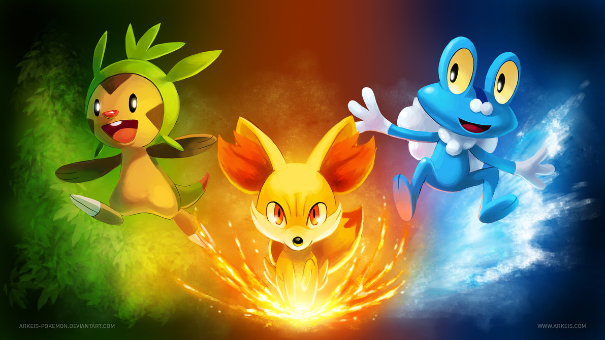

It has been 16 years since the first Pokemon game came out in Japan in 1996, wow thats a long lifespan for a game! While some might say that the hype has died down over the course of time, other still believe that Pokemon is as popular as ever especially with the release of X&Y last Saturday which brings gamers the 6th generation and into a completely new region: Kalos and around [60 new cute little critters](http://www.serebii.net/pokedex-xy/300.shtml) to catch.

---

My Friend got Pokemon X on Saturday and has been playing it ever since. Now at 5 badges and going strong with her Delphox named Homra. I watched my friend Darrell play it when he got it on the day as well. There are graphic improvement, a new story, some new mechanics, but the core mechanics of the game are still there, so a Pokemon-illiterate person like me (cause I have only played though half of first gen) could understand pretty much everything that happened.

These guys are the 3 new starters and as usual, you get to chose one of them to be your friend and trusted companion on your journey around the region. [Chespin](http://www.serebii.net/pokedex-xy/650.shtml), [Fennekin](http://www.serebii.net/pokedex-xy/653.shtml), & [Froakie](http://www.serebii.net/pokedex-xy/656.shtml). I like Fennekin the most, but I think Chespin is the cutest starter (don't really like his evolutions as much as Fennekins).

TechCrunch wrote a [nice article](http://techcrunch.com/2013/10/13/pokemon-y-is-for-grown-ups/) about this new generation of Pokemon, I recommend you read about it if you are interested in this 2 decade old game.
