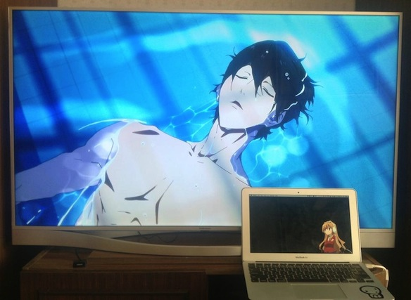
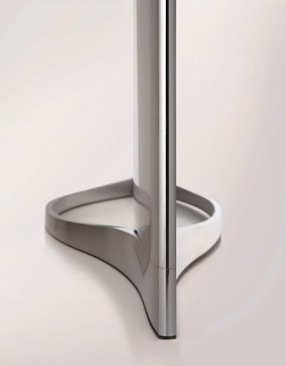

When I arrived back home and set foot in my house again after 3 years of being abroad, I could not help but notice the 12 year old TV in our living room. It was a Sony Trinitron and looked something like [this](http://2.bp.blogspot.com/_hvUgLTILEVE/SaDTi8HMQnI/AAAAAAAAFxU/G4oPHbFnmIM/s400/TV+Trinitron.JPG), I dont have a picture of ours and we already gave it away. とにかく、it was old and outdated, a serious upgrade was required. Thankfully my dad was on my side on this one and so we set out to buy a new TV, yay!

<!--more-->

One of our (Latvias) main electronic companies, [Elkor](http://www.elkor.lv), had a sale on Samsung TVs, so naturally thats where we went. At first we were contemplating on getting a 50" model, but after some measuring it was evident that a TV of that size simply wont fit in between our cupboards and wardrobe.

So we decided on looking at various 46" models instead. The one that caught my dads eye was the F8500 series TV. The reason was that instead of the 1700Ls price ($3400) there was a 600Ls discount and thus it was only 1100Ls ($2200). Can you imagine that?! A $1200 discount on a TV which was made in Q2 of this year!

Aside from the very alluring price tag, the design on this model is something you would expect Apple to make. Brushed aluminum, beautiful curves, elegant design. I was sold just by that. The UI of the OS is still Samsung, but I can live with that.

This baby has everything you would want and more. Smart TV, Internet connection via Wifi or cable, 3D, even a Siri-like voice command interface and a Kinect-like gesture control system. The last 2 though don't work perfectly, but hey they are not the main selling point of this TV, so I don't care.

The image is beautiful. When watching 1080p shows, YouTube videos or anime it is just breathtaking. The colors are so pretty and everything looks like its in 3D even without the glasses.

Three times I tried launching .mkv files through a USB and the TV crashed on me every single one. But playing anything from my MacBook Air via an HDMI cable works so I am happy.

Here is a link to a [review of the TV](http://www.expertreviews.co.uk/tvs/1297630/samsung-f8500-led-tv-review-hands-on) when it was announced and the [video of announcement](http://www.youtube.com/watch?v=XQlCvCDEGGc) itself.
