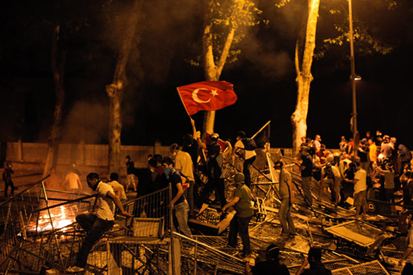

As you might have heard, the current situation in Turkey is rather severe. The people are in the streets protesting and rioting, all for one goal: take down the current prime minister [Recep Tayyip Erdoğan](http://en.wikipedia.org/wiki/Recep_Tayyip_Erdoğan) and to stop his policies of censorship and limitations on freedom of speech and expression.

---

There is a rather good article on [Wikipedia](https://en.wikipedia.org/wiki/2013_protests_in_Turkey) on the whole situation and if you want to get a better understanding of it, I suggest you take a look. Also a Taiwanese group called NMAtv made an animated video explaining the situation and what stirred up the people to start rebelling:

<iframe src="http://www.youtube.com/embed/7wwSPRpVJZE" height="315" width="560" allowfullscreen frameborder="0"></iframe>

Also the internet group Anonymous is helping the people out on this one. They have already broken into several government websites and databases, and are continuing to infiltrate the network of Turkey. Anonymous fights for the freedom of speech and expression, just like V from *V for Vendetta,* and I completely support them. Dictatorship will not be tolerated, especially when it comes to censorship of social media! The prime minister thinks that social media is the worst menace to society [(TechCrunch)](http://techcrunch.com/2013/06/05/social-media-is-worst-menace-to-society-says-turkey-pm-25-twitter-users-arrested/), well lets see who has the last laugh.
