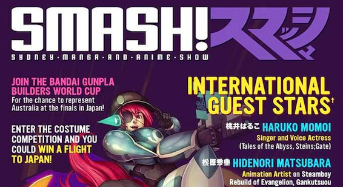

[SMASH!](http://www.smash.org.au "SMASH!") \- the Sydney Manga and Anime SHow is a convention happening every year in Sydney, and its goal is to celebrate the culture of Anime, Manga, Video games, and Cosplay. Saturday, August 10th 2013 at 9am the Sydney Exhibition Center Darling Harbour opened its doors for over 7000 pop culture fans from around Australia and even overseas. Aside from big companies like [Madman](http://www.madman.com.au/) and [KingsComics](http://www.kingscomics.com) smaller circles and clubs were given stalls to sell their own merchandise; [Anime@UTS](http://utsanime.net) was no exception. We had badges, post cards, phone charms, even panda hats.

<!--more-->It was an amazing experience! So many people, so many good cosplays, so many things to buy, so little time! (Though, this time I didn't buy anything). There were special guests from Japan as well, not only the main ones listed on the site, but also 2 very special people: [8#Prince](http://vocaloid.wikia.com/wiki/Hachiouji-P) and [kz](http://vocaloid.wikia.com/wiki/Kz). These guys make Vocaloid music, and they are not just some nobodies, these guys are famous, and I mean super famous, look at their profiles on Vocoloid wiki and see the songs they made. After SMASH there was a Vocaloid night party where they were preforming, WOW that was epic! Thats the type of club I want to go to to have fun. What killed me though during that was when kz played Irony and Reunion, I just started jumping up and down like crazy and shouting out the lyrics, as these are my favorite [ClariS](http://jamiejakov.lv/tag/claris/) songs. All the feels!

Overall the day was amazing, I cosplayed Accelerator from [Index](http://myanimelist.net/anime/4654/Toaru_Majutsu_no_Index "To Aru Majutsu no Index"), my friends and follow club members also cos/crosplayed (pics down bellow), I got to see some stunning costumes and just had an overall fun experience being at a convention. Most of my good friends were actually volunteering this year, helping out either at the information desk or at Vocaloid night or just helping out everywhere they could. Ruben wrote up his thoughts on his [first time working at SMASH!](http://rubenerd.com/first-year-working-for-smash/)

NHK news made a small article about it, so if you can read japanese [here is a link](http://www3.nhk.or.jp/news/html/20130810/k10013688581000.html).

<iframe src="http://imgur.com/a/3Xg9g/embed" height="550" width="100%" frameborder="0"></iframe>
