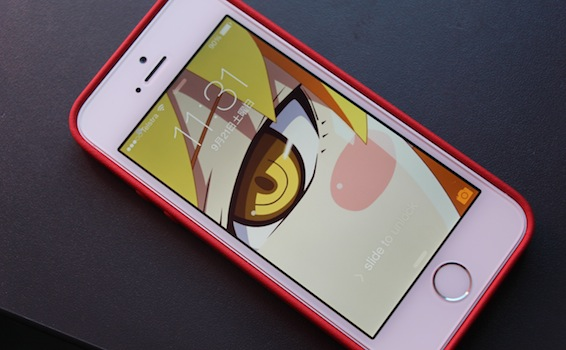
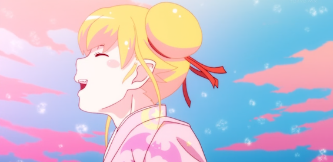

This has been a very expensive week for me, but I can honestly say that it was worth it! [GTA V](http://www.rockstargames.com/V/), [iPhone 5s](http://www.apple.com/au/iphone-5s/) and the [Bower & Willkins P3](http://www.bowers-wilkins.com/Headphones/Headphones/P3/explore.html) headphones are all mine, and I sure as hell am enjoying all of them. I'll talk about my purchases in chronological order, so first up I would like to start with one of the best games (and definitely the most anticipated) of the year -

**GTA V**

The game was set out to come out at exactly 12am on the 17th of September. Naturally I preordered it, but then I also decided to go to the store at like 11:30pm to wait for the midnight release and pick it up straight away to get some gaming time before going to bed. I can say one thing, good thing I came 30 minutes early! I managed to get a spot at the front of the line (8th or 10th) thereby getting the game right away at 12 and heading home. The game cost $89 (which is the normal price for the standard edition of any console game in Australia).

---

When walking out of the store I could see the number of people standing in line to both JBHifi and EBGames stores. Id say around 200 people were there that night. A truly massive game launch for a truly massive game. I am currently on 8 hours of gameplay and 19% passed. Once I clear all the missions and start having fun with this huge open world, I will write up a review of it, so stay tuned.

**iPhone 5s**

Next up is my story of how I got myself the latest gadget to come from Apple. After selling [my iPhone 5 (iChitanda)](/posts/2012/my-new-iphone-5/) to my high school IT teacher - Natalia Ivanovna Rodina, when I went [back to Latvia](/posts/2013/tadaima-im-home/) in July, I have been left without a smartphone. For 3 months I was walking around with a 5 year old Samsung brick. I am not complaining. I actually did enjoy not being on Twitter and Facebook all the time, but stuff like my japanese dictionary and train timetables were greatly missed.

Anyway, at 4am me, Wilmer and his friend went to the Chatswood Apple store (Wilmer was nice enough to drive us there on his car, yay!). 4:30am we line up in front of the store and wait until they open up at 8am. During that time I managed to finish watching [Dick Figures The Movie](/posts/2012/dick-figures/), and may I saw it was awesome, and a japanese talk-show about hafu (ハーフ) - people, who have 1 japanese parent and one foreigner, and about their life in japan, especially if they don't know english. 8am I get my new phone, all is good (some minor complications with my credit card, but got that sorted out). $869 for the phone, $79 AppleCare extended warranty, $48 Red leather case, $269 P3 Headphones. So here it is my beauty:

Her name is iShinobu because it has been a tradition of mine to name each iDevice in the name of my favorite anime girls. Here is the list:

- Mac Mini - iKonata ( *[Lucky Star](http://anilist.co/anime/1887/Lucky9734Star)* )
- MacBook Air - iTaiga ( *[ToraDora](http://anilist.co/anime/4224/Toradora)* )
- iPhone 4 - iKirino ( *[OreImo](http://anilist.co/anime/8769/Ore-no-Imouto-ga-Konnani-Kawaii-Wake-ga-Nai)* )
- iPhone 5 - iChitanda ( *[Hyouka](http://anilist.co/anime/12189/Hyouka)* )
- iPad 3 - iRin ( *[Usagi Drop](http://anilist.co/anime/10162/Usagi-Drop)* )
- iPad mini - iYuri ( *[Angel Beats](http://anilist.co/anime/6547/Angel-Beats)* )
- AirPort Express - iSaki ( *[Eden of the East](http://anilist.co/anime/5630/Higashi-no-Eden)* )
- AirPort Express 2  - iTogame ( *[Katanagatari](http://anilist.co/anime/6594/Katanagatari)* )
- and now the iPhone 5s, which was given this name because of the ever so cute vampire girl [Shinobu Oshino](http://anilist.co/character/23602/Shinobu-Oshino) from the _[Monogatari series](http://anilist.co/anime/17074/Monogatari-Series-Second-Season)_.

