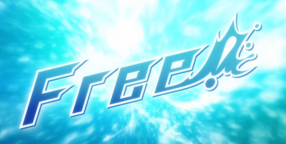
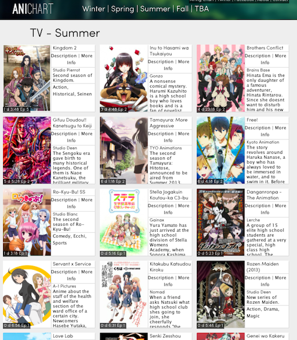

2013 summer season of anime has officially started today with a marvelous new show by Kyoto Animation: _[Free!](http://myanimelist.net/anime/18507/Free!)_

Here is a list of what I am looking forward to and picking up, not guaranteeing that I wont drop some though:

<!--more-->

1. *[Free!](http://myanimelist.net/anime/18507/Free!)* \- Hot guys swimming. Need I say more? ah yes: made by KyoAni. next
2. _[Danganronpa](http://myanimelist.net/anime/16592/Danganronpa:_Kibou_no_Gakuen_to_Zetsubou_no_Koukousei_-*The_Animation)* -  Survival game, based of a video game, sound cool, my fellow club members are saying it will be good, so might as well
3. _[Monogatari Season 2](http://myanimelist.net/anime/17074/Monogatari_Series:_Second_Season)_ - Based Shaft, most anticipated series of this season. Lets see if shaft can make it as good or even better then Bake 1
4. *[Genshiken Nidaime](http://myanimelist.net/anime/18465/Genshiken_Nidaime)* - Currently watching Genshiken 1 and 2, loving the series and the characters, definitely looking forward to this. Its an anime about an anime club, how can I not watch it.
5. *[The World God Only Knows III](http://myanimelist.net/anime/16706/Kami_nomi_zo_Shiru_Sekai_III)* - An anime about a video game god conquering girls season 3, yea of course. I read most of the manga so looking forward to seeing how they anime this arc.
6. *[Blood Lad](http://myanimelist.net/anime/11633/Blood_Lad)* - people say its gonna be good, so why not. Vampires.
7. *[Watamote!](http://myanimelist.net/anime/16742/Watashi_ga_Motenai_no_wa_Dou_Kangaetemo_Omaera_ga_Warui!)* - as mentioned [here](http://jamiejakov.lv/anime/wata-mote/), I AM SO HYPED FOR THIS.
8. *[Gin no Saji](http://myanimelist.net/anime/16918/Gin_no_Saji)* \- a guy goes to the countryside to study farming... Not that intriguing right? Made by the same guy who made FullMetal Alchemist.
9. _[Kimi no Iru Machi](http://myanimelist.net/anime/17741/Kimi_no_Iru_Machi_\(TV\))\_ - great manga, good OVAs. Expecting the anime adaptation to be good as well. Love story with drama.

Oh wow I am planing to watch 9 thing this season. Where will I find the time O.o

 Click on image for website with the chart.

