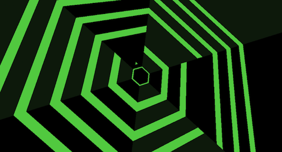
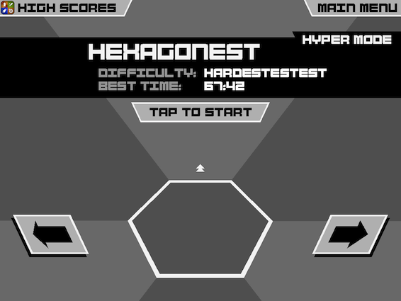

 I was introduced to this game by my friend Patrick. I remember that day well, it was before one of our club karaoke sessions, Pat came over and said something along these lines: "Hey Vadim, I know you love [juBeat](http://en.wikipedia.org/wiki/Jubeat), here is a game that will test your skills even more. Its called [Super Hexagon](http://superhexagon.com)."

<!--more-->

At the time I didn't know what I had gotten myself into. This game is seriously addictive. Why? well because you want to beat it!

The mechanics are rather simple: turn the small triangle in the middle around the hexagon and try evading the incoming lines. There is always a gap which you can go through, the thing is... with each level, the speed of the lines coming towards you increases. To clear the level you need to survive for 60secons. Of course you can go over and prove that you are the very best, like no one ever was, cause you dont have to pass that test, that is not your real cause. There are 6 levels overall: hard, harder, hardest, hardester, hardestest, hardestestest. Each with its own color scheme and tricks. In the beginning you have 3 levels unlocked and then by clearing them you unlock the other 3.

You don't think its hard? Well take a look at the trailer.

<iframe src="//www.youtube.com/embed/2sz0mI_6tLQ" height="315" width="420" allowfullscreen frameborder="0"></iframe>

The game is available for [PC, Mac, iOS, Android and BlackBerry](http://superhexagon.com).

Finally after over 6 months of playing it, I finally managed to clear the hardestestest level and complete the game!

Thats it, its over, I'm done... or am I? This game doesn't have a end, you can keep on going, keep on improving your score, keep on bragging to your friends at how awesome you are XD.

Is the game good? You bet it is. Could anyone play? If you know how to touch a screen or press a button then yes! Would I recommend it? To anyone and everyone now!

Simple, addictive, insanely fun.

**10/10**
