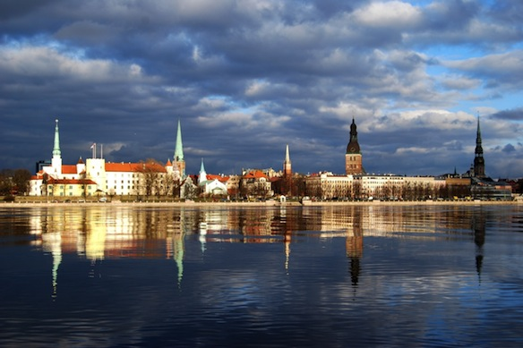

After my [crazy flight](/posts/2013/what-a-long-strange-trip-its-been/) yesterday I am home, finally, after 3 years, I am home. Riga has barely changed in these past 3 year that I have been away. Some improvements here and there, we got new trams! (pics on Flickr, and link at the end of the post). There are so many things I have missed, like our beautiful and quiet parks, our gorgeous *[Art Nouveau](http://en.wikipedia.org/wiki/Art_Nouveau)* style architecture, our clean fresh sea air, our delicious european food (+ potatoes) and of course our blazingly fast and reliable internet.

My main purpose was to get a new passport as this one is about to expire in November, and of course to see my parents. But just after one day of being back I feel like I have never left. There are so many things that are dear to me here, so many memories, so many feels. I will be back in Riga for another month, I will keep posting some stuff out what is happening here and what I am up to and of course continue my regular posts about tech and anime (especially with the new season starting next week).

link to photo album: 
