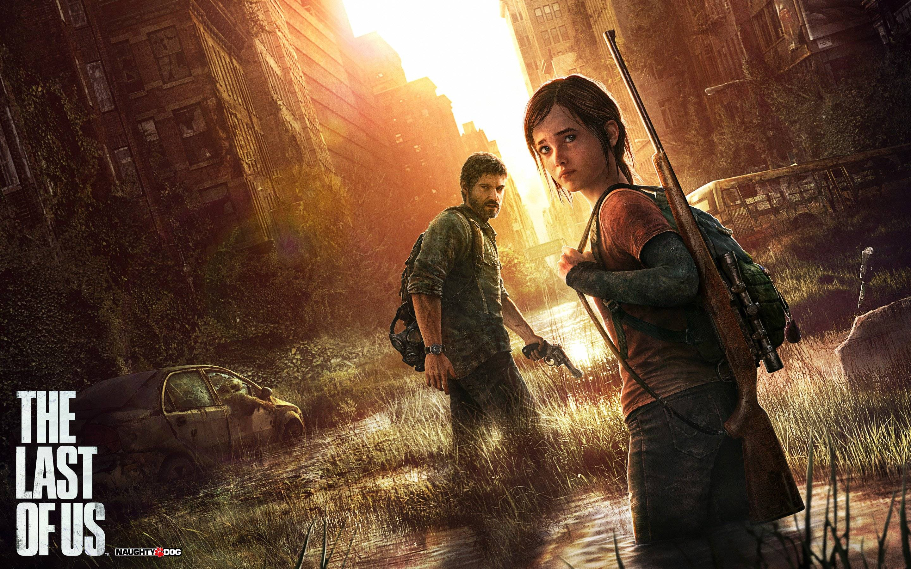

This is so overdue! I should have finished _[The Last Of Us](http://www.thelastofus.com)_ before going back home to [Latvia](http://jamiejakov.lv/travel/tadaima-im-home/), but at that time I was only about 60% into the game. So now, 15 hours of gameplay later, I am done! And I can clearly say that this title deserves to be called the best game of 2013 (we shall see what happens when Watch Dogs and GTAV come out). I will try to keep this review as spoiler free as possible, but at the same time I would like to cover all the parts of the game and at least mention the characters that played a vital role in the story.

---

If I had to describe this game in one sentence, I would say: "Imagine if *[Uncharted](http://en.wikipedia.org/wiki/Uncharted)* and [_Half Life 2_](<http://en.wikipedia.org/wiki/Half-Life_(series)>) had a baby". Seriously, one of the zones in _The Last of Us_ felt so much like Revenholm in _HL2_ and other parts of the game felt like _Uncharted_. The concept is that at one point a virus has started going around and once a human is infected he becomes a mindless zombie who can only kill healthy people, or infect them by biting them. You have our main character Joel who survives the initial wave of infection and is living in a quarantine zone. He is tasked to take this girl Ellie (our second main character) half way across the country. Why? Because she is infected, and has been for the past 3 weeks, but is still sane, she is still normal and healthy. We have a cure! But we need professional doctors to extract it from her, and they are somewhere far far away.

<iframe src="//www.youtube.com/embed/eXKSXRF7dhE" height="315" width="560" allowfullscreen frameborder="0"></iframe>

If you have seen *[I am Legend](http://www.imdb.com/title/tt0480249/)* you can somehow imagine what is is to live in a world which is overrun by zombified infected. The main goal of this game is not to provide amazingly revolutionary mechanics or features which have not been used in any other game before. No, _The Last of Us_ was made for the story. Same as with the _Uncharted_ series Naughty Dog wants to tell us a story in the format of a game. And it worked marvelously. The amount of detail that was put in the characters and the acting was superb, the landscapes were very well drawn and the music was perfect to the situation.

Without spoiling too much I just want to say that the only thing that I didn't like about this game was the ending, I expected it to have a similar ending to the Uncharted games, but it wasn't. I don't know if it is my _WoW_ experience that is making me say this, but at the end of some content there should be an end boss.... And he should be harder then the most of the monsters in the game so far. A last boss is meant to test all the skills that we have acquired during this long journey. Of course as I said before, the main point of *The Last of Us* is the plot, so I kinda understand why the ending turned out the way it did, but I wish it was a bit different.

To summ up, so far it is the best game of the year, it has received amazing rating from almost all game review websites and critiques, and I would recommend everyone to play it as soon as possible.

**9.9/10**
