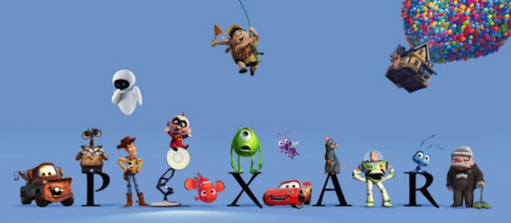

 I went to my good friend [Clara’s](http://kirinyan.net 'kirinyan') blog and saw [an article about Pixar](http://kirinyan.net/pixar-movies-are-secretly-about-the-apocalypse/ 'Pixar Movies are Secretly About The Apocalypse'). Well Pixar being my favorite western animation studio (Shaft, KyoAni, Ghibli are still my top3 in japan) I just had to read it. It is a interesting [theory by this guy - Jon Negoroni](http://jonnegroni.com/2013/07/11/the-pixar-theory/ 'The Pixar Theory') but its so crazy that it might even be true! Hey they even mention time travel to fit in Monsters Inc and Brave.

As Clara put it, she was:

> blindmown.

I concur! After reading this theory I have the sudden urge to to rewatch all the Pixar movies in the chronological order that he made as if they were connected.
