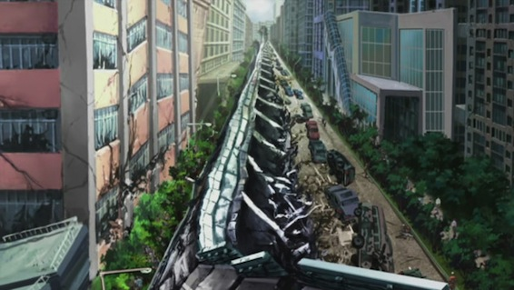
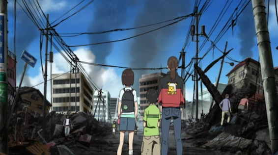

Last thing I fully watched was [Tokyo Magnitude 8.0](http://myanimelist.net/anime/6211/Tokyo_Magnitude_8.0) so I decided to write up a small review about it. I was warned that it is that kind of series that will make you feel very emotional for the characters. I can say one thing.... IT WAS!

<!--more-->

Basically what happens is, there are these 2 kids (brother Yuuki and sister Mirai) who go to a robotics show in Odaiba when tokyo gets hit by a massive 8.0 magnitude earthquake. Now that Tokyo is in ruins they need to find their way home to their parents.

This whole story is very touchy and you can really feel what the characters have to go through in every episode. Honestly it made me cry at least 4-5 times during these 11eps.

I highly recommend everyone to watch it. There are not many anime which make us feel so deeply for the characters.

**8/10**

