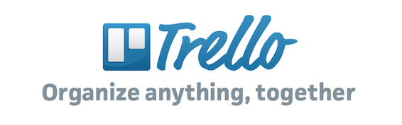
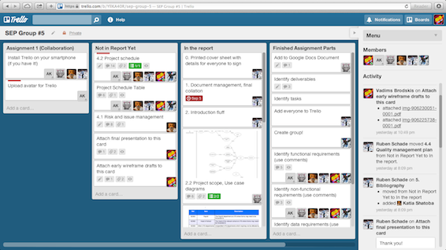

Today I'd like to talk about [Trello](http://trello.com). Trello is a cloud based organsation and collaboration software which can be used in creating personal plans and schedules as well as work on projects with a team. With an extremely easy to use interface and a vast set of features I say safely say that I will be using Trello in the future a lot!

---

Initially introduced to me by my close friend [Ruben](http://rubenerd.com) during our Digital multimedia class, I wasn't too impressed and we didn't end up using it that much. This semester however for our Software Engineering Practice (SEP) class we had to use a project management tool called Jazz Hub ([I wrote about how it crashed](/posts/2013/so-no-lab-this-week/) a few weeks ago). After playing around in Jazz for a good hour the whole team (6 people) decided that its too complicated for our needs and we switched to Trello, which our team leader Ruben proposed.

We haven't looked back ever since. The interface is slick and easy to use, the software itself is reliable and gets the job done; it even has integration with dropbox and GDrive, which is very convenient for our causes. This is what our task pane looks like right now, we have finished and submitted the first part of our project -  the documentation and are ready to move on to the next stage:

Overall I am very pleased with my experience with this software in the past 4 weeks and since we will need to use a project management tool for the rest of our assignments for SEP, I am relieved that we are using Trello.
