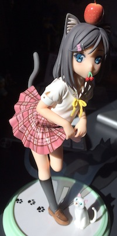

Meet the newest member of my figure collection - [Tsutsukakushi Tsukiko](http://anilist.co/character/42469/Tsukiko-Tsutsukakushi) from the show [変態王子と笑わない猫](http://anilist.co/anime/15225/Hentai-Ouji-to-Warawanai-Neko). She is a cute little girl who wished to lose all of her emotions so that she wouldn't appear childish to her friends. Even though throughout the series she barely shows any signs of happiness or sadness, we can still see when she is angry or shy. They portray Tsukiko as a cat because the cat god was the one who fulfilled her wish and also because cats are a general symbol of cuteness in Japan, and Tsukiko is too damn cute!

When the show was coming out in April 2013 I immediately knew that it would be popular as it has cute girls and a hentai protagonist who both the girls are in love with. The formula for a successful anime: cute girls + sexy scenes = profit. Thats is what sells in Japan and we can not do anything about it. But hey, I preordered this figure from [AmiAmi](http://amiami.com) and it cost me about $40, but I regret nothing! 2 hours of work for this beautiful thing is totally worth it.

Anyway, I have more pictures of her on my:

