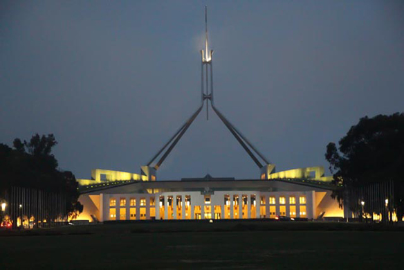

I have been living in Australia for almost 3 years now, but I have never been to the capital! \*shock\* So I decided that now, right before exams, would be the perfect time to go visit this small city. And what fun is it to go alone... So of course I went there together with my girlfriend at the time - [Saya](http://twitter.com/KSnpy).

---

Many of my friends said that there is nothing interesting in Canberra and that I would just be wasting my time by going there. I would beg to differ. Yea sure Canberra is not the most interesting place, but it does have some great museums and memorials.

When we arrived there it was 10:30am, 8° and raining. Not the most pleasant day I can say, but we made it worth wile. Our first stop was the War Memorial. It was very interesting for me to learn about how Australians see the wars that happened throughout the century. This was a very emotional experience not only for me, but for Saya as well. Since Australia is located so far away from the rest of world and mainly Europe where all the action was happening during WWII, their main enemy was Japan. Now you can imagine how hard it would be hearing that your own county is the enemy and how ruthless the *Japs* were during the war. Aside from that it was an extremely moving experience, remembering the war that is.

After spending almost 5 hours in the War Memorial looking at all the weapons, artillery, airplanes, and listening to a free tour by a navy war veteran, we headed to our second point, which was the National Art Gallery. Unfortunately we were not allowed to take any photos inside, so you will only see some on the outside.

And lastly we walked by the parliament house and took some night pictures of that.

If anyone asks me wether Canberra is worth visiting, I will no doubt say yes, because I believe it is very important to remember about the wars that our ancestors fought and also just looking around the city and going to other museums is a change from our daily life here in Sydney or any other big city.

Photos can be found on my 
