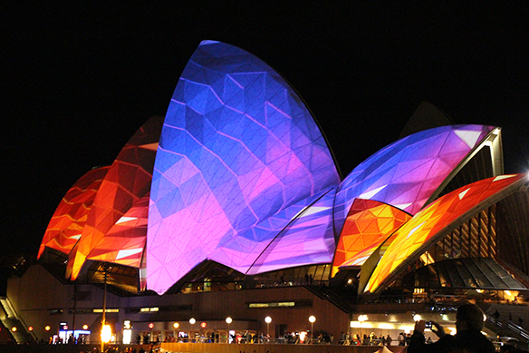

So on the 5th of June, [Saya](http://twitter.com/KSnpy) accompanied me to go look at the Vivid light show in Circular Quay and Darling Harbour.

This is the third time I've visited the festival, and wow I can say it amazes me how many different colours and designs and animations they can make and project onto the buildings. What can I say it looks amazing.

Pictures speak louder then words:

