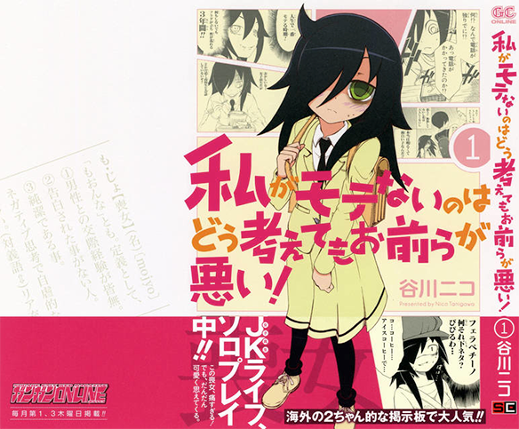

There was this one manga which wasn't really that popular in good old Japan, but then everything changed when the gaijin attached! The guys from [4chans /a/](http://boards.4chan.org/a/) just fell in love with this manga. People started buying multiple copies and thus dramatically improving its sales. It got so popular that they even started printing that its a huge hit on the western 2chan on the cover of it (as can be seen on the picture below). And this manga is of course [Watashi ga Motenai no wa dou Kangaetemo Omaera ga Warui!](http://www.watamote.jp) or Wata Mote for short.

---

The story is about a 15 year old high school girl who is a complete shut in and is socially awkward. Like I mean it, she cant talk to anyone aside from family and 1 girl who she used to be friends with in elementary school. Yet we all love her. To some she might even be a representation of themselves, you lonely otaku hikis....

So far 3 volumes have been released (and of course I own all 3) and the 4th one coming in July (already preordered). But whats more important is that this glorious manga is getting an anime adaptation! Woah right? [Next season (summer 2013)](http://www.animenewsnetwork.com/news/2013-06-05/watamote-anime-1st-promo-with-izumi-kitta-song-streamed) this show will have 23min episode every week for 12 weeks. Well all I can say is that I am seriously looking forward to see how they animate it, but judging by the PV, it looks awesome. Also the VA fits the role perfectly!

<iframe src="http://www.youtube.com/embed/WPNaCGQjDFc" height="315" width="560" allowfullscreen frameborder="0"></iframe>
