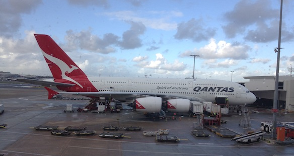
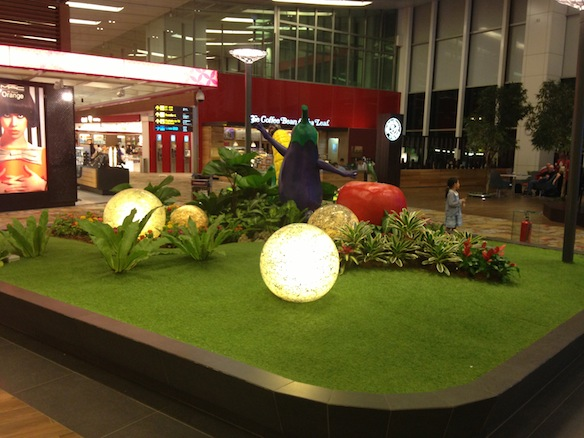
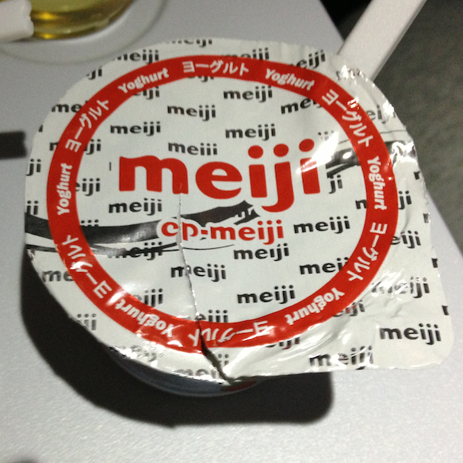

(That is not my plane)

It was a good plan, a simple plan, nothing crazy... But it turned into soooo much more because of one small mistake, one small slip up... I am talking about my trip back to Latvia. The original plan was to fly from Sydney to Singapore, spend 1 night and most of the day there with my good friend [Wilmer](https://twitter.com/wilmerang) then catch a flight from Singapore to Helsinki the next day, lastly connecting to a flight from Helsinki to Riga. Well the Quantas check in people at  Sydney International Airport had a different plan for me...

---

**Prequel**

The whole reason I am heading home instead of my usual 1 month trip to Japan over the holidays is because my passport is due to expire in November (4 months away). And since Australia does not have a Latvian embassy, so I pretty much had no choice but to go home. That was fine, I can see my family and the leftovers of my high school friends that are still there.

The first problem came to be when our tour agent accidentally booked my tickets from Singapore to Helsinki on a wrong date, so instead of spending 3 hours in transit in Singapore I had to spend 27. Bummer.... Well I came up with this great plan that Wilmer would pick me up and I would just hang out with him for the day. No problem right? Latvian citizens don't need a visa to singapore if staying under 90 days, so I thought I was all set. Thats what the plan was, up until yesterday when I went to check in.

**26th of June, 11:30am**

My flight was at 1:05pm so I arrived two and a half hours early. The lady at Quantas check in informed me that I will not be able to disembark into Singapore as my passport is only valid for 4 months, but the law requires a foreign passport to be valid for at least 6 to enter the country/city. That was the first blow. Then she (and 2 of her colleagues who she called for assistance) told me that I am not allowed to spend more then 24 hours in airport transit as it breaks some other rule.... So they said that I have no choice but to change my flight. I went to the Quantas ticket stand, explained my situation and asked if there is a possibility to get on tomorrows flight. And the answer was.... NO. All booked all full, they cant help me. This is when I started to lose it, I called Finair (the other airlines which I am flying with) office in Sydney to ask them to change my ticket from Sing to Helsinki from the 27th at 11:30pm to the 26th at the same time. And of course they couldn't do that. Lost I woke up my mom and asked her for help, she tried getting hold of our travel agent, but that didnt work (obviously it was 4am in Latvia at the time).

The moment I found out I cant disembark in Singapore, I called Wilmer to inform him of the situation. He was amazing! He kept me calm and helped me find other routes with other airlines that would get me to singapore before 11:30pm on the 27th. A huge thanks for all the help and I am sorry I couldn't meet you in Singapore.

I was already ready to give up and go home, but I had 1 last chance. It was 12:05 already, so 1 hour left to my flight from Sydney. I went up to the Quantas check-in counter again, and there was a different lady. I explained her the whole thing and she said she will help me get around this and get me to Singapore today. WOW! She tried her best but then another problem arised... Apparently the flight I was supposed to take was already full cause I had a very late boarding. (Well its not my fault your other staff told me I couldn't take this flight!). She called a manager who offered me to go to Singapore with British Airways at 3pm instead. At this point I was happy to accept anything, as long as I can leave Sydney and get to Singapore in one piece. They somehow managed to check-in my baggage (though I doubt it will reach Riga, will write an update when home) but I had a boarding ticket to Singapore! YES! The nice lady from Quantas also gave me a $30 food voucher to have lunch, because I had to change my flight.

So at this point I was frantically calling Wilmer and my Mom and telling them what is happening. After finally getting my bearding pass we (me and mom) decided that we will change my flight from Singapore to Helsinki from the 27th night to the 26th once the travel agent opens up at 8am. While I was on the plane, my parents did just that!

**Singapore (26th 9:40pm)**

8 hours later I am in the most beautiful airport I have ever seen, Singapore. My parents changed my tickets so I had to board the 11:30pm flight to Helsinki today (26th), meaning I had less then 2 hours to re-checkin and tell them to find my luggage. Well lets hope they did.

The 12 hour flight to Helsinki was good, I slept for 8 hours so I feel kinda ok. They also served strawberry Meiji yoghurt for breakfast!!! That made me really happy.

**Helsinki (27th 6am local time)**

So now I am sitting here in Helsinki airport, waiting for another hour for my flight to Riga when this crazy journey will end. I feel fine and I am relieved that I this whole situation managed to sort itself out without any extra costs.

**Riga (27th 1pm)**

I am now home, safe and sound, eating all the delicious food my mother made for me.
