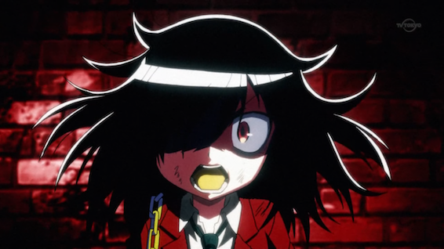
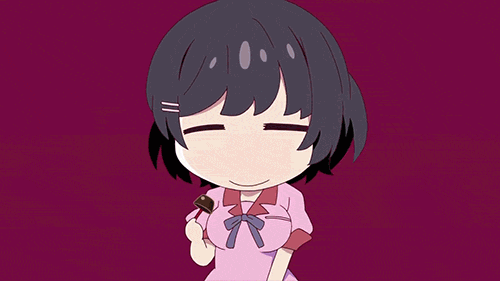

The summer 2013 anime season is already in week 3 so I might as well say what I am watching and give some recommendations, [just like I did in 2012](http://jamiejakov.lv/anime/recommended-summer-2012-anime/).

<!--more-->

My friend [Seb](http://twitter.com/sebasu_tan) wrote up his mini review of this season and what he is watching [on his blog right here.](http://alonelyseptember.org/anime-summer-season/)

So I am watching 12 things this season.... WOAH....

- [**Free!**](http://myanimelist.net/anime/18507/Free!) - KyoAni, hype, swimming, bishounen, hype, naked guys, etc. Its amazing! #nohomo
- [**Gatchaman Crowds**](http://myanimelist.net/anime/18229/Gatchaman_Crowds) - It gives me the feeling of [Tiger and Bunny](http://myanimelist.net/anime/9941/Tiger_&_Bunny), but the main girl is sooooooo crazy, she makes [Nyaruko](http://myanimelist.net/anime/11785/Haiyore!_Nyaruko-san) look normal.
- [**Genshiken Nidaime**](http://myanimelist.net/anime/18465/Genshiken_Nidaime) - The third season of an anime about otaku in a university anime club. Loved the first 2, loving the manga, definitely a must watch, cause the are referencing new anime and thats just so cool.
- [**Gin no Saji**](http://myanimelist.net/anime/16918/Gin_no_Saji) - an anime about agriculture, somewhat like [Moyashimon](http://myanimelist.net/anime/3001/Moyashimon). Made by the same guy who made the [Fullmetal Alchemist](http://myanimelist.net/anime/5114/Fullmetal_Alchemist:_Brotherhood) manga, so the artstyle looks very similar.
- [**The World God Only Knows Season 3 The Goddesses Arc**](http://myanimelist.net/anime/16706/Kami_nomi_zo_Shiru_Sekai:_Megami-hen) - If you know the first two or the manga, must watch. If not, go watch the first 2 and read the manga.
- [**Railgun S**](http://myanimelist.net/anime/16049/Toaru_Kagaku_no_Railgun_S) - continuing from the previous season this is a prequel to the Index and Railgun series.
- [**Servant x Service**](http://myanimelist.net/anime/18119/Servant_x_Service) - Resembles [Working!!](http://myanimelist.net/anime/18119/Servant_x_Service) a lot and has the best OP of the season hands down.
- [**Danganronpa**](http://myanimelist.net/anime/16592/Danganronpa:_Kibou_no_Gakuen_to_Zetsubou_no_Koukousei_-_The_Animation) - Mystery anime with a survival game similar to [Mirai Nikki](http://myanimelist.net/anime/10620), based of a game, should be good.
- [**Kimi no iru Machi**](http://myanimelist.net/anime/17741/Kimi_no_Iru_Machi) - The [manga](http://myanimelist.net/manga/8483/Kimi_no_Iru_Machi) was good, had high hopes for the anime, not that great so far...
- [**Shingeki no Kyojin**](http://myanimelist.net/anime/16498/Shingeki_no_Kyojin) - Best series of last season by far, and I would even say that its the best series this year, it has generated way to much hype. The series is very solid and has a good premise. If you dont trust me, [here is a link](http://www.youtube.com/watch?v=kd383XVbMXE) to a first impression video by AnimeZone.
- [**Wata Mote**](http://myanimelist.net/anime/16742/Watashi_ga_Motenai_no_wa_Dou_Kangaetemo_Omaera_ga_Warui!) - amazing [manga](http://myanimelist.net/manga/28533/Watashi_ga_Motenai_no_wa_Dou_Kangaete_mo_Omaera_ga_Warui!), amazing series. Unpopular girl trying to live a normal high school life and is failing, but in a cute way :)
- **[Monogatari Series Season 2 (Zenmonogatari)](http://myanimelist.net/anime/17074/Monogatari_Series:_Second_Season)** \- Best show ever: 3rd season. Shaft is doing it again. The animation, the quality, the character development, the plot!

So there you have it. Its a big list, so I have no idea how I am supposed to keep up to date with all of this, AND do well in my studies this semester... Буду стараться, чё!

(gif by my good friend [mad](http://fekete-rigo.tumblr.com 'mads "blog"'))
