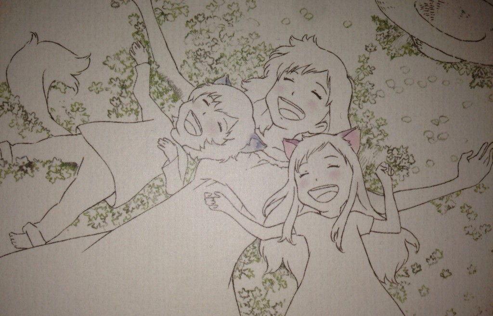
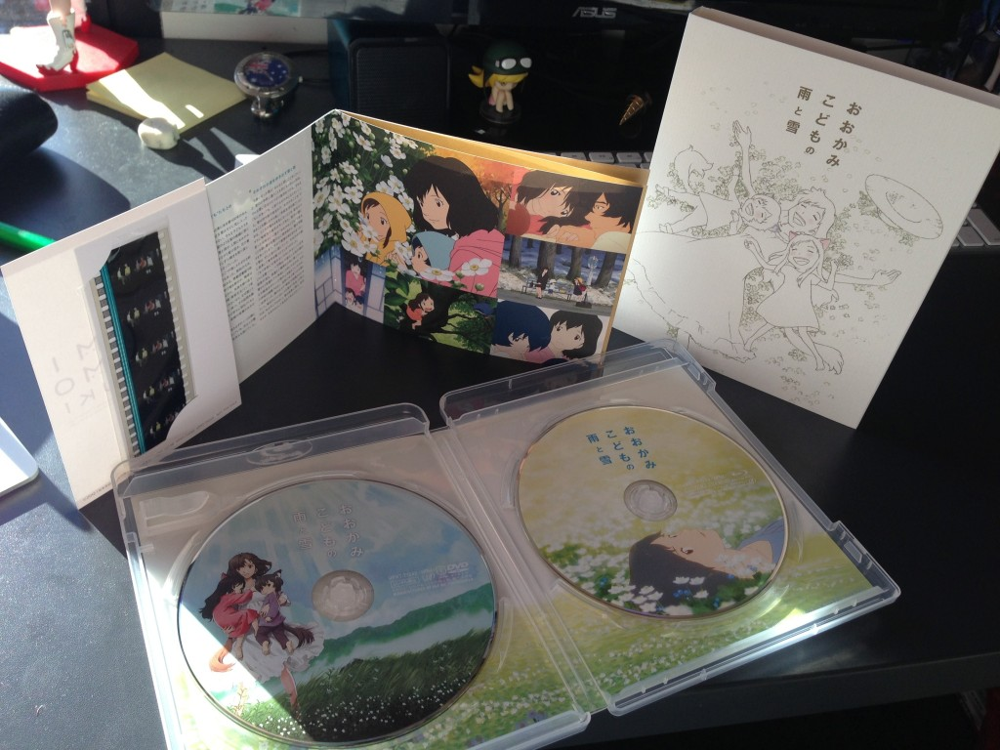
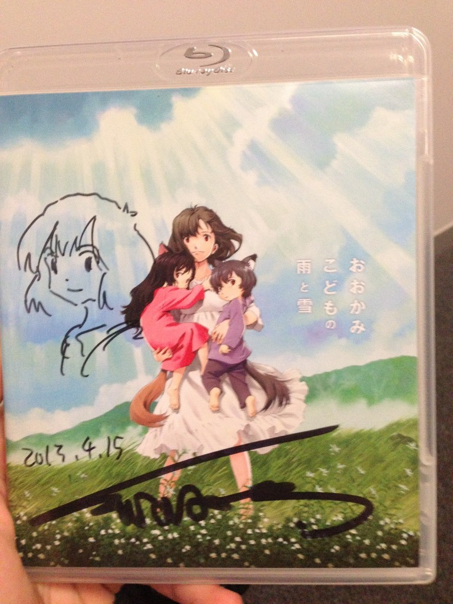

Remember when I first blogged about how I got to see [Wolf Children Ame and Yuki in Osaka in July](http://jamiejakov.com/2012/07/23/おおかみこどもの雨と雪-no-spoilers/)? Well After that [Madman](http://www.madman.com.au) had a screening of Wolf children in Sydney, sometime in September, I think, and thats when most of my friends from the anime club went to watch it together. Of course I was with them, and I can say that I cried more the second time I watched it, then the first. Anyway, fast forward to today and here we are again, at a madman screening of Wolf Children. But it is no ordinary screening when you just get to watch the movie.

---

This time the director - Mamoru Hosoda came to Sydney and did a Q&A session with the audience, and then he was signing posters (which were only given to the first 20 people who lined up, and for some reason cause I was first I did not get one....) and DVDs of his works. Well naturally I had be different and instead of just getting a copy of The Girl Who Leaped Through Time or Summer Wars, which are available on both DVD and BD in Australia, I needed to get the BD of Wolf Children, which only got released in Japan 2 weeks ago. So a week before the film, I ordered the BD from [AmiAmi](http://www.amiami.com/top/detail/detail?gcode=MED-DVD2-18374&page=top%2Fsearch%2Flist%3Fs_keywords%3Dwolf+children%24pagemax%3D50%24getcnt%3D0%24pagecnt%3D1) with express shipping. Here is what the box looks like and everything that is inside:

So today after watching the movie for the third time in the cinema, I got the box signed, so I am gonna keep it forever and ever! Also almost all of my friends got a poster and Mamoru Hosoda signed it for them too. You can read my friend Sebastians [blog about it here](http://alonelyseptember.org/wolves-and-directors/).

And without further adieu, here is my signed BD copy of Wolf Children:

