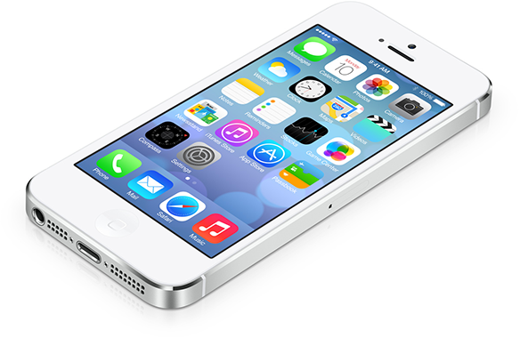
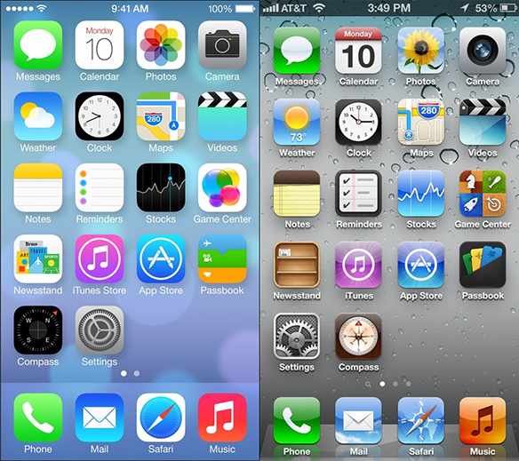

Tonight at 3am Sydney time, Apple had their World Wide Developer Conference (WWDC) where they announced many new changes to both their software and their devices. You can read the full coverage on [9to5mac.com](http://9to5mac.com/tag/wwdc/). But I will just quickly mention what I love about it.

<!--more-->

Main things are the new improved MacBook Airs, a revolutionary new Mac Pro and of course the new OSX 10.9 Maverick.

But the main point of attraction this year was iOS7.

The OS looks stunning, the fonts are amazing, and the minimalism is exactly what we need from an OS now. Cant say I like the icons that much, but I think I will grow to like them. My words are not enough to express how impressed I am in this new design. Its definitely a step forward. Here is a comparison on how the icons changed. Also by clicking the image you will be taken to the apple.com website.

Comparison between iOS7 and iOS6 Image from [Reddit](http://www.reddit.com/r/apple/comments/1g2k85/quick_comparison_of_the_iphones_home_screen_on/).
