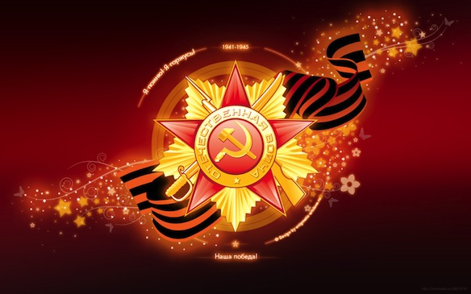

Хочу поздравить всех моих родителей, друзей, знакомых и всех жителей России и стран СНГ!

Ещё тогда нас не было на свете, Когда гремел салют из края в край. Солдаты, подарили вы планете Великий Май, победный Май!

Ещё тогда нас не было на свете, Когда в военной буре огневой, Судьбу решая будущих столетий, Вы бой вели, священный бой!

Ещё тогда нас не было на свете, Когда с Победой вы домой пришли. Солдаты Мая, слава вам навеки От всей земли, от всей земли!

Благодарим, солдаты, вас За жизнь, за детство и весну, За тишину, За мирный дом, За мир, в котором мы живём!

М. Владимов
