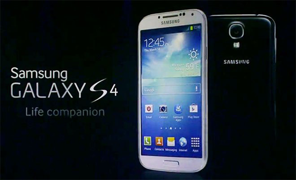
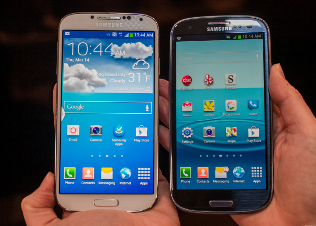

[http://www.gizmodo.jp/2013/03/galaxy_s_iv_10.html](http://www.gizmodo.jp/2013/03/galaxy_s_iv_10.html)

サムスンGalaxy S4のハンズオン批評である。14日にニューヨークでサムスンが新スマートフォンを発表し、Gizmodoが即行触って見た。筆者の感想は平凡であった。「新端末S4には多くのものが詰め込まれているが、胸が熱くなるようなものはない」と書かれていた。

---

世界で一番人気なAndroid機種の昨年発表されたS IIIは4000万台を売り上げた。なぜならその携帯が前のSIIより革命的だったからである。しかしS3と比べてS4は革新が少なさそうである。

S4にはハードウェアが新しいCPUや13メガピクセルカメラや2GB RAMや2600mAhバッテリーが更新されて、業界スタンダードと言える。

ソフトに関しては、S4が盛りだくさんで新規のものが多い。一番面白そうなソフトはSmart PauseとSmart Scrollである。目の動きを読むシステムである。画面の外を見たら、動画が止まり、そして、端末を上／下に傾けることでスクロールができる。

私はサムスンの商品あまり好きではないが、テクノロジーに非常に興味があり、毎日ニュースを読む。S4 は iPhone 4Sような更新であり、そんなに革新的ではないと思う。なぜなら、新ソフトは実用的かどうかまだはっきりわからないからである。胸躍るような革新がなかく、ただのアップグレードではないか。そのソフトはAppleのように充実したユーザーエクスペリエンスが提供できないだろう。とにかく、テクノロジーは急速前に進んでいて、来年までサムスンの主力商品はGalaxyS4である。

したがって、発売まで一ヶ月待ち、しっかりとS４の資質を見ないと判断はできない。

 
