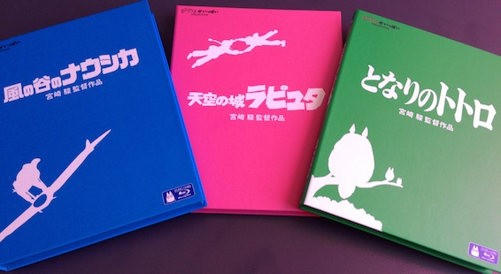

When I was in Japan in July of 2012, my friend Kosuke and I went to Tokyo for a few days (I blogged about it). We also visited the Ghibli museum in Mitaka. It was an awesome experience, but there is one thing I really regret not doing there. In the gift shop there were Soundtrack CDs (OSTs), DVDs and most importantly the new Ghibli collection BluRays! They were 7140円 a piece, which at the time I deemed to be too expensive for a BluRay at the time. But when I came back to Sydney, I realized that I seriously wanted them. Thats how I started my collection. First I got Nausicaa, then my amazing friend Frank gave me Totoro for Christmas and Laputa for my Birthday! It will take me a while to get all of the Ghibli BluRays, but I accomplish this goal I have set for myself. If anyone is interested, I order them from this website: [cdjapan.co.jp](http://www.cdjapan.co.jp/detailview.html?KEY=VWBS-1189 'cdjapan')
