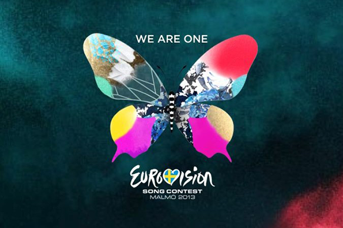

ユーロビジョンとは欧州で開催される毎年恒例の音楽コンテストである。 この大会は１９５６年以来毎年開催されており、欧州国だけではなく、オーストラリアや日本含めてヨーロッパ域外の国々放送されている。

--- 各国の代表歌手が歌を披露した後に、欧州国国民による投票が行われる。そして最高点をもらった国が優勝し、優勝国は次の年のヨーロビジョンを自国で開催地する権利を得る。 今年のヨーロビジョンはスウェーデンで開催され、オーストラリアSBSテレビでも今月の１9日に決勝が放送された。今大会では、準決勝の時点で優勝候補だったデンマークのエミリー・デ・フォレスト（Emmelie de Forest）さんが優勝した。彼女は「Only Teardrops（涙のしずくだけ）」を歌って281ポイントを獲得した。

<iframe src="http://www.youtube.com/embed/p3f9v8ebuD4" height="315" width="560" allowfullscreen frameborder="0"></iframe>

欧州にとってこの大会は娯楽だけではなく、自国に誇りを持ち国の力を証明する機会だと思う。欧州には様々な国があり、色々な文化や習慣が混じっているので、自国の特徴を欧州だけではなく、世界に見せたいという気持ちで歌手がステージで歌っていると感じる。 [２０１２年大会ではスウェーデンが圧倒的に人気だった。](http://www.youtube.com/watch?v=Pfo-8z86x80)今大会で、デンマークは圧倒的な勝利ではなかったが、私は今大会でエミリー・デ・フォレストの「Only Teardrops」が一番良いと思ったので、彼女が勝ってよかった。ちなみに今まで私の一番好きな歌は２００９年のノルウェーの「Fairy Tale」だ。

<iframe src="http://www.youtube.com/embed/WXwgZL4zx9o" height="315" width="560" allowfullscreen frameborder="0"></iframe>
