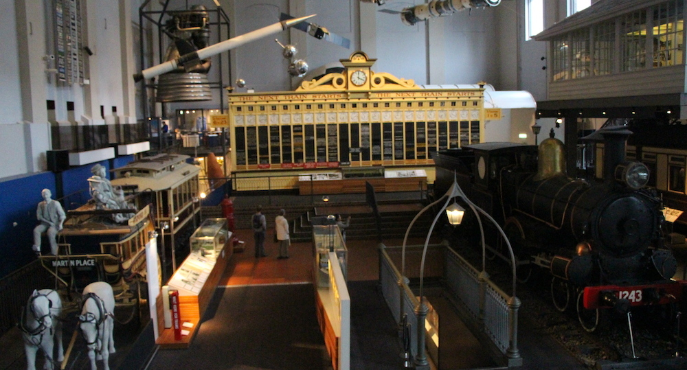

So since the weather in Sydney hasn't been that great lately, my girlfriend at the time - [Amy](http://twitter.com/dekopatchi) and me decided to go the [Powerhouse Museum](http://www.powerhousemuseum.com), which is so conveniently located only 5 minutes away from where I live. Amy hasn't been there since middle school, or something, and I went there last when the Harry Potter exhibition was on in 2011, I think.

---There were a lot of interesting things on display, such as steam trains, space ships and satellites (включая спутник 1), and other sciency stuff like magnets and lights. Also they had a rather interesting exhibition of the history of the Beatles in Australia. Too bad that there were too many people so I couldn't get any decent shots. There was also a small light display, think [Vivid](/posts/2013/vivid-sydney/), but more interactive and in a smaller space. They even had a room with lasers going from one side to the other, like in those Mission Impossible movies where they have to avoid touching the lasers, because they will set off the alarm. So cool.

One of the most impressive displays to me was the timeline of the most essential and influential inventions of humanity. Starting with the printing press, continuing with the engine and then getting to the computer, finishing off with the smartphone! I was really surprised that they would include the smartphone as a revolutionary device. I guess until we invent something even more amazing, the smartphone will be the pinnacle of human invention.

Overall it was a very entertaining experience and I would recommend anyone interested in science and a  bit of history to go take a look. Did I forget to mention that we got to play some retro games like Donkey Kong, Space Invaders, Arcanoid and others.
