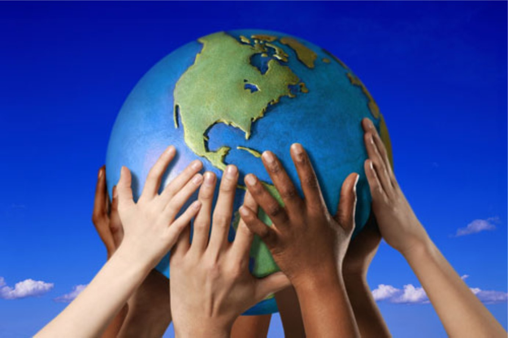

**境目につての私の経験と考え**

境目とは物理的な線にかぎらず、空想的ないもしない分離線である。例えば、地球が形作った時代に生み出した大陸や季節の境目が今まで残っている。そして現在世界では人間が樹立した経済的や政治的や社会的な境目も存在している。

私はラトビアにうまれたので政治的な境目を自分で感じた事がある。ラトビアは欧州連合に入った前に欧州の国に旅行するのは大変だった。普通に国境線で５時間ぐらい待たなければならなかった。しかしバルト三国は欧州連合に入った後に国境線はなくなり、旅行時間も減少した事が大進歩であった。国々の政治や政府は変わってないのに国と国の「境目」はほとんどなくなった。

---

境目は少しずつ薄くなると考える。川上弘美は書き表した人間同士の境目というものがオーストラリラではあまり感じられないのである。シドニーでは様々な国の人が暮らし、もうそんなに強く区別しない、皆が平和に生きている。もちろん全世界の境目がなくなったら、いい事ではないと強く信じている。自分のアイデンティティを守るのは大事だが、シドニーのような市に住んだら、自国化の境目を超えて、今いる国の文化を受け止めなければならないと思う。「郷に入らば郷に従え」

**移動する子供達**

このトピクでは移動という言葉は、ただ引っ越しの意味ではなく、自宅を変えて新しい場所／国や文化に雰囲気に踏み込むことである。

セインカミュさんのように、何回も国から国へ移動し、習慣に馴染めなければならなかった。文化や習慣や言語ところか、自分の外面は変わっていたのせいで、日本に暮らし外人と呼ばれていた。しかしこの言葉は悪い意味を持つかどうか、人によって違っていると思う。

その感覚や気持ち私にとって不明ではない。ラトビアに生まれロシア人に育て私は子供の頃から自分のアイデンティティをよく理解でない。ずっとラトビアに住んでいたが、ラトビア語は上手ではないし、ラトビア人と同じ日を祝いしていないし、自分の生まれた国に誇りをあまり持っていない。しかし、逆に私はロシア人ではない。ロシア語は母語で、両親も私を普通のロシア人としてそだてられたのに、ロシアに２回しか行った事ないし本物のロシア人と話すと、私の事を外人（ラトビア人）と呼ばれている。その上に今はオーストラリアに移動してシドニー工科大学に通い、この国に完全な部外者なのに、なんだか溶け込んでしまった。もちろん心も考え方も両親は育てられたようにロシア人なのだが、オーストラリアの習慣や生活に馴染むのが問題ではなかった。

最後に現代社会では子供のころから移動するのはそんなに珍しいものではないから、問題に普通にならないはず。しかし住むために自分にとって他国に移動したら、たった一つのことを覚えるべきだ：「郷に入れば郷に従え」。

**外国語って何？**

この質問を分かるため、まず母語という観念を理解しなければならないと思う。ラトビアに生まれロシア人の私にとって母語はロシア語である。なぜなら両親はロシア人であり初めての話した言葉もロシア語だったからである。それに限らず、何かを言う前に頭で考えている時もロシア語を使っている。問題を解けても、レポートを書いても、友達とあるトピックを論しても、自然にロシア語で頭が動いている。その理由に基づいてロシア語は私の母語とはっきり言える。

外国語は自国で自然じゃない、普通に会わない言語だと思う。しかしグローバリゼーションのせいで英語はすでに国際語になってしまったので、外国語とはもう言えない。私にとって外国語は欧米の国々の言語やアジアの言語である。

自分の国に入れば他国の言語と出会う状況はもう様々な国にとって当然な事になったのではないか。例えばアメリカやオランダやオーストラリアでは多文化であり、そして南アフリカでは色々な言語が国語として認められている。

外国語という観念は国々にとって変わっているので簡単に定義できないではないか。一般的に言えば自国にない、自然ではない言語や言葉であると思う。
