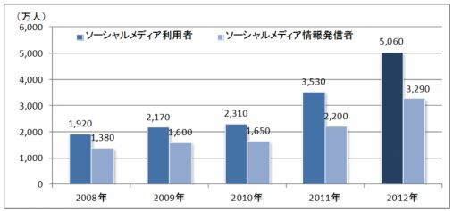
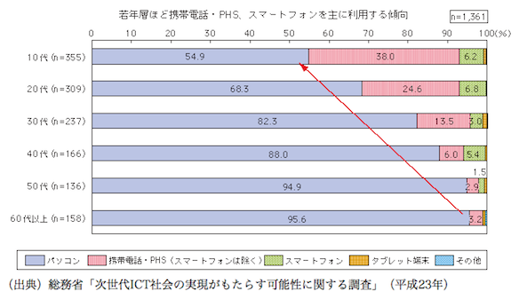

**UTS日本語授業の自由研究レポート：**

**既存メディアに影響したソーシャルメディア**

**\- 序論**

ティモシー・ジョン・バーナーズ＝リーは１９９０年にWold Wide Web (WWW)を考案し、[ハイパーテキスト](http://ja.wikipedia.org/wiki/%E3%83%8F%E3%82%A4%E3%83%91%E3%83%BC%E3%83%86%E3%82%AD%E3%82%B9%E3%83%88)システムを実装・開発した人物である（ウィキペディア、2013）。 インターネットが普及する前はテレビや新聞やラジオのようなメディアからのみ最近のニュースや情報を得る事ができた。そしてインターネットが広がると同時に、情報を手に入れる方法も増加した。 その方法の一つはソーシャルメディアである。 現代社会では、人々は完全にインターネットに夢中になっている。

しかし、インターネットの開発とともにテレビやラジオや新聞などの既存メディアに対する興味が徐々に減少しており、若者層にFacebookやTwitterやブログのようなソーシャルメディアが流行っている。なぜなら、天気、スポーツ、ニュースなど、ありとあらゆる情報がインターネットでいつでも手に入れられるからである。その上ニュースサイトでは記事に対する自分の意見をコメントできるため、人々はこのような自分自身も意見を投稿できるウェブサイトを好むのではないだろうか。そのことを検証するためインタビューを行った。

本稿では、インタビューの結果によって得たデータを集め、他の研究者の記事を分析し私が予想する現象が起こっているかどうかを検証する。

<!--more-->

以下では、まず既存メディアとソーシャルメディアの定義を示し、インタビューや記事のデータによって現代の状況を説明する。次に情報源とその情報の信頼性を検討する。そして最後に今後、既存メディアとソーシャルメディアがどのように変化していくかを予想し述べる。

**\- 本論**

自宅から出なくても友人と会話ができたり、写真や動画を共有できるアイディアはインターネットが普及し始めた時からとっても魅力的だった。そこでさらにソーシャルメディアというウェブサイトやソフトウェアが発明された。しかし、他者との関わり方や写真•動画の共有の仕方が変化したばかりではなく、情報が広がる速さ、またその情報をどのように受け取るかも変わってきている。既存メディアとソーシャルメディアのことをわかるため、まずはこの二つの定義を示さなければならない。

**定義**

既存メディアとはインターネットが発達した前のマスメディアの事である。このレポートではラジオや新聞やテレビを既存メディアとして取り上げている。

ソーシャルメディアは誰もが参加できる情報発信技術を用いて、社会的インタラクションを通じ広がっていくように設計されたメディアである(Kaplin 2009, 翻訳)。それはFacebook•Twitter•Tumblr•Reddit•2ちゃんねる•4chanのようなウェブサイトとブログなどのサービスを含んでいる。SMHやNYTやYahoo!NEWSには一般人は記事を投稿できないので、ソーシャルメディアに含まれないが、WordPressやBloggerで作ったブログや個人サイトはソーシャルメディアとして調査している。つまりソーシャルメディアとは人々が自分の意見や感想を投稿できる場所である。

japan.internet.comの記事によると、去年インプレス R&Dのインターネットメディア総合研究所はソーシャルメディアの利用動向調査を行い、その結果を示したものが以下のグラフである。

**グラフ１：**ソーシャルメディア人口推計値

このグラフによると、２００８年から２０１２年にかけてソーシャルメディア利用者が1.9千万人から約３倍の５千万人に増加している事がわかる。そのことから、人々はより多くの時間をラジオ•新聞•テレビではなくインターネットに費やすようになったのではないだろうか。これを証明するため４人の日本人にインタビューをし、さらに他の友人を対象にアンケートを行った。

**インタビューの説明と結果**

インタビューした日本人は、現在オーストラリアに留学し英語を勉強している２１歳の学生３人と、２８歳のUTS科学博士号である。

使用しているメディアやそのメディアに費やす時間、他人の意見の重要性や情報の信頼性、様々なメディアの違いについて質問をした。どのような情報を信頼するか、そして自分がネットでどのくらい能動的だと考えるかを知るため、「自分で投稿やコメントしますか。」と質問した。

インタビューの対象者は全員ソーシャルメディアで自分の意見を述べず、ネットでも論じないと回答した。Eさんは個人個人の意見を見るのが好きだと答えた。情報に対して様々な人の意見があるから、いろいろな意見を聞くことで自分の意見が変わることもあるというのが、４人の共通意見だった。このインタビューを通して、私はソーシャルメディアの方がもっと情報を集めやすく、もっと便利で社会的ではないかと考えた。しかしどの情報を信じるか、どの情報が正しいかはメディアの利用者が自分自身で調べなければならないと思う。

**情報源と信頼性**

信頼性についての質問の結果は様々であった。「日本のマスメディアは、まったくといっていいほど信頼できない」とKさんが言った。 このKさんの意見から、情報源によって信頼性も変わるという私の考えは強くなった。 WさんとNさんはソーシャルメディアの情報を全然信頼できなし、Yahooニュースのようなサイトしか読まないと述べた。ネットでデマが広がることがあるため、その２人と同じように考える人は多いと考える。例として、2011年の震災時にはコスモ石油の爆発により有害物質が雲などに付着し、雨などと一緒に降るするというデマがインターネットで広まった（ 吉次　2011）。

**変化している社会** 

事故や事件が発生した時だけではなく、日常的もメディアが人の生活に影響を与える。どんな国でもある程度、政府がマスメディアを操作しているのではないか。インタビューやアンケートによって、人々はこの政府による操作を理由にマスメディアに対する信頼を少しずつ失っていることが分かった。 さらに、佐藤（2011）によると、既存メディアを発信する大手テレビ局等は大都会に集中しているため、震災が地方で生じた場合、被災者への情報伝達が困難になり得る。事故や事件が起きた場合、情報が早く伝達することは非常に重要だと考える。 震災時、既存メディアに比べソーシャルメディアを利用した方が被災者はより早く情報を得る事ができた。ソーシャルメディアを使い情報は驚くべき速度で世界中に広まる。その上、忙しい毎日を過ごしているサラリーマンや学生はテレビのニュース番組に費やす時間がないため、自分に必要な情報を手に入れたい。そこで、インターネットやスマートフォンを使うと必要な情報を効率よく手に入れることができる。2011年の総務省の調査によると、１０代から６０代以上のどの年代でもパソコンを主に用いているものの、10代の半数近く、20代の約3分の1がソーシャルメディアを利用する際に携帯電話やPHS、スマートフォンを主に利用する等、若者の間でモバイル端末でのソーシャルメディア利用が一般化している。

 

**グラフ２：**ソーシャルメディア利用に主に用いる端末（年代別）

従って、簡単に最新の情報にアクセスできるので、インターネットが利用可能な携帯電話やスマートフォンはテレビやラジオや新聞よりずっと便利で現代若者にとってずっと魅力的なのではないか。

**結び**

最後に、私を含めインタビューしたWさんとNさんとKさんは既存メディアが完全に無くなってもあまり困らないと考えている。一方で、コンピューターとスマートフォンの使い方を知らない高齢者にとって既存メディアのない生活は不便であるとEさんは答えた。でも、現在の世界の状況や研究の結果をみたら、ソーシャルメディアが主な情報源だということは明確である。

**\- 結論**

本稿では、ソーシャルメディアと既存メディアの定義を示し、ソーシャルメディアの利用動向のグラフを使って、ソーシャルメディアの人気を明確にした。４人の日本人のインタビューを行ったがデータが不十分だったため、アンケートを作成し友人に回答してもらった。集めたデータをまとめたら様々なことが分かった。まず、既存メディアとソーシャルメディアの信頼性は人によって異なるということだ。日本のマスメディアは全く信用できないという人もいれば、情報源によってその信頼性は異なると考える人もいた。また、ネット上であまり投稿やコメントはしないが、テレビ•新聞•ラジオよりネット掲示板やソーシャルネットワークを使う人が多いことや、若者層に比べ既存メディアが主に使われている世代があるということにも気づいた。

これからソーシャルメディアはさらに人々の情報伝達の主流となっていくのか、既存メディアの利用者はどのように変化するのか、スマートフォンやiPadなどのインターネットの便利さが新聞のような既存メディアを衰退させるのか。そのような点について今後我々は考えるべきだと思う。

**\- 参考文献**

- ウィキペディア　2013　「_World Wide Web」_　＜[http://ja.wikipedia.org/wiki/World\_Wide\_Web](http://ja.wikipedia.org/wiki/World_Wide_Web)＞ 2013.05.25
- Kaplan, A.M. & Haenlein, M  2010, ‘Users of the world, unite! The challenges and opportunities of Social Media’  _Business Horizons,_ Vol. 53, Issue 1, pp. 59-68.
- japan.internet.com　2012　「_日本の SNS 人口、前年比143％ -- 「Facebook」約3倍、「mixi」微減」_　＜[http://japan.internet.com/wmnews/20120615/7.html](http://japan.internet.com/wmnews/20120615/7.html)＞ 2013.05.25
- [かさこ](http://blogos.com/blogger/kasako/article/)　2012　「_Yahoo!ニュース個人の意義～震災で明らかになった既存メディアの限界」_　＜[http://blogos.com/article/47433/](http://blogos.com/article/47433/)＞ 2013.05.27
- 吉次　由美　2011　「東日本大震災に見る大災害時のソーシャルメディアの役割」＜[http://www.nhk.or.jp/bunken/summary/research/domestic/133.html](http://www.nhk.or.jp/bunken/summary/research/domestic/133.html)＞ 2013.05.29
- 佐藤　和文　2011　「多メディア時代の震災報道」　＜[http://blog.kahoku.co.jp/web/archives/2011/10/post\_299.html](http://blog.kahoku.co.jp/web/archives/2011/10/post_299.html)＞
- 総務省　2011　「ソーシャルメディアの可能性と課題」＜[http://www.soumu.go.jp/johotsusintokei/whitepaper/ja/h23/html/nc232310.html](http://www.soumu.go.jp/johotsusintokei/whitepaper/ja/h23/html/nc232310.html)＞
