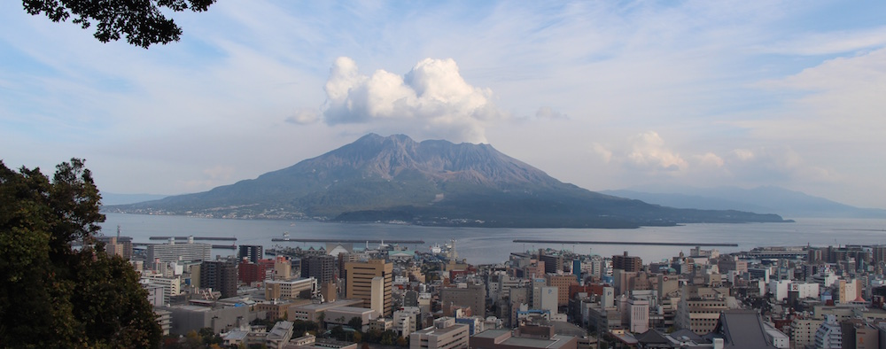
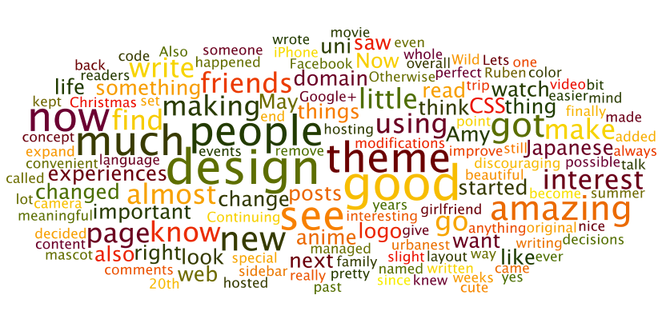

Wow, that went by rather quick. I remember how I was writing up the [2013 retrospective](/posts/2013/2013-retrospective/), as if it was yesterday. Why did the year fly by so quickly? Well I guess it is due to me being in Kagoshima, Japan! A new region to explore, a whole new bunch of Pokemon to catch! ... wait a minute, wrong world. Anyway, lets see what the most memorable events were this year.

---Lets make it a list, shall we:

- In January I found out that I passed [JLPT N2](/posts/2014/jlpt-n2/ 'JLPT N2 Passed!'). That was a great achievement, which I am super proud of. Thought I highly doubt that I will ever take N1, even thought I feel my Japanese has greatly improved while living here for 1 year.
- I turned [21 this year](/posts/2014/my-21st-such-madoka-much-ghibli-wow/), and I got to celebrate my birthday by winning a cosplay competition and watching the 3rd Madoka Movie. Of course there was a proper celebration as well, with much food and really good presents.
- Right before leaving for Japan I visited [Vietnam and Cambodia](/tags/vietnam-cambodia-2014/) with my lovely parents.
- And also we got to see [Kyary Pamyu Pamyu live in Sydney](/posts/2014/きゃりーぱみゅぱみゅ-live/). One of the best things to happen this year for sure!
- Well and then in April I left urbanest in Sydney, and left for Japan. After arriving in Kagoshima I was [swarmed with paperwork](/posts/2014/brand-new-day-brand-new-life/) and setting up my new home for the year.
- Settled down, and ready for the year, I began studying in Kagoshima university and entered a laboratory which researches human vision.
- Oh boy did I travel, of course not by myself, but with my girlfriend (at the time) - Amy. We went all over the place: Kansai, Tokyo, Hiroshima, Fukuoka, Nagasaki, Oita, and around Kagoshima. All these travels and experiences can be found [here](/tags/ics/).
- We also saw [Angela Aki](/posts/2014/angela-aki-live-in-kagoshima/) preform live in Kagoshima. Not only is she a very talented singer and pianist, but also she is really beautiful.
- Aside form Traveling around Japan, we also went to [Korea](/posts/2014/korea/) with Amy's mom. That was of course after Amy joined me and my family for a few days in the [onsens of Ibusuki](/posts/2014/ibusuki/).
- In September, Amy and I went to a small onsen village called [Kurokawa Onsen](/posts/2014/kurokawa-onsen/). There we spent 3 days just relaxing, enjoying the food and the atmosphere.
- When the second semester of uni began, we got a whole new group of students from Turkey, France, Germany, etc. And we created the [gaijin gang](/tags/gaijin-gang/), together traveling around Kagoshima and now they went to Nagasaki (without me, cause I've already been there, twice).
- And now finally we are up to christmas and New Years. Amy and I are just relaxing in Kagoshima, and I am cooking us some Olivier Salad and bread with caviar.

С Новым Годом! See you all next year!

And here are the words which were used most in my posts:

