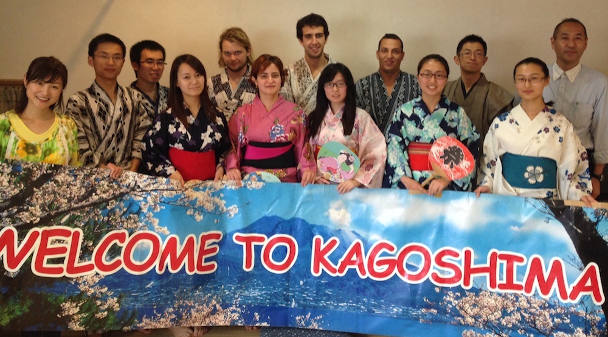

Onsen (温泉) is the Japanese word for hot spring and public bath. These bath houses are a very essential part of Japanese culture and there is even a fictional story about it ([Thermae Romae](http://en.wikipedia.org/wiki/Thermae_Romae)). The reason I came to Japan was to experience all of its cultural aspects, and so I find myself going to an event for foreign exchange students to learn about the culture of Onsen.

---The island of Kyushu (九州), on which Kagoshima is located, is famous across Japan for its beautiful and refreshing Onsen. As I have never been to one before, this was a great opportunity for me to try it out and learn the ways of the Onsen. Most importantly, you must get fully naked and wash yourself; then after making sure that your are perfectly clean, you can enter the relaxing and rejuvenating waters of the baths. Of course completely naked as well. For some it might be a rather embarrassing experience. Well let me just add that there were 5 TV channel crews and around 13 people in there with us. That was pretty..... interesting.

Well anyway, we were on TV! And on the NHK [website](http://www3.nhk.or.jp/lnews/kagoshima/5053972001.html?t=1400138794188).

Here are the videos:

<iframe src="//www.youtube.com/embed/YKm3IwlrA30" width="560" height="315" frameborder="0" allowfullscreen="allowfullscreen"></iframe>

<iframe src="//www.youtube.com/embed/R4Mtw_5_-As" width="560" height="315" frameborder="0" allowfullscreen="allowfullscreen"></iframe>

<iframe src="//www.youtube.com/embed/p5oIcfVc1KA" width="640" height="360" frameborder="0" allowfullscreen="allowfullscreen"></iframe>

At the end of this whole thing we were given a small lecture on how to make and pour real Japanese green tea. And we got a free teapot at the end! Its so pretty!

Original from NHK:

> 外国人留学生が日本の温泉を楽しむ   
> 5月15日 14時21分 
>
> 外国からの留学生たちに日本の温泉文化を楽しんでもらおうという催しが鹿児島市で行われました。 
>
> この催しは、鹿児島市の民間の温泉施設が初めて行ったもので、中国やフィリピン、それにドイツなど   
> ６か国から鹿児島県内の大学に留学している１１人の男女が参加しました。 
>
> 初めに留学生たちは、温泉施設の大広間で従業員から入浴のマナーについて説明を受け、   
> 湯船に入る前には必ず体を洗うことやタオルを湯船に入れてはいけないことなどを学びました。   
> このあと浴場で体を洗い流したあと、ゆっくりと温泉につかりました。   
> 留学生のほとんどは温泉を初めて体験するということですが、広い湯船にじっくりと肩までつかり、   
> 気持ちよさそうな表情を浮かべていました。 
>
> ラトビア出身の男子学生は「温泉に入ったら、日頃の授業の疲れが吹き飛びました。   
> 両親が鹿児島に来たときは連れて行きたい」と話していました。 
>
> ソースに動画があります。 
>
> ソース： [NHK](http://www3.nhk.or.jp/news/html/20140515/k10014471251000.html)    
> 画像： [image](http://www3.nhk.or.jp/news/html/20140515/K10044712511_1405151540_1405151540_01.jpg)
