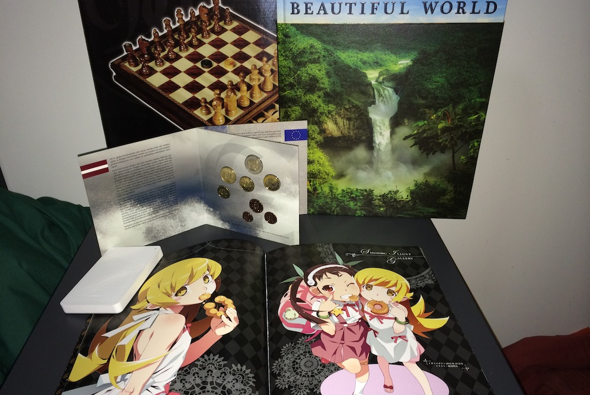

Continuing on with my birthday celebrations from the [1st of February](http://jamiejakov.lv/life/my-21st-such-madoka-much-ghibli-wow/), I had 2 more parties. One with my friends from [urbanest](http://urbanest.com.au) on the 8th of February, exactly a week after my official birthday and then one more today with my friends [Ruben](http://rubenerd.com) and [Clara](http://kirinyan.net), who couldn't make it to my birthday on the 1st. (And Seb was there too) We went to IKEA and had a lot of meatballs! So many that I didn't even have dinner. Ruben and Clara gave me the amazing Shinobu heroin book and the new [Latvian euros](http://rubenerd.com/latvia-adops-the-euro/), which they had ship from Latvia! Thank you so much! I did however have to go through 6 layers of wrapping...... again......

I would also like to take this opportunity to thank my friends from urbanest for their gifts. Especially Anna for the Beautiful World photo book, I must definitely visit all these places! And thanks to Dennis who got the guys together to get me a big chessboard, which me and Amy have already broken in, so to say. Also Darrell, thank you for the newest edition to my hard drive family, it is so small cute and white that I can barely resist myself.

I think I have a few more presents coming soon, so I might expand this post later on. Stay tuned.
