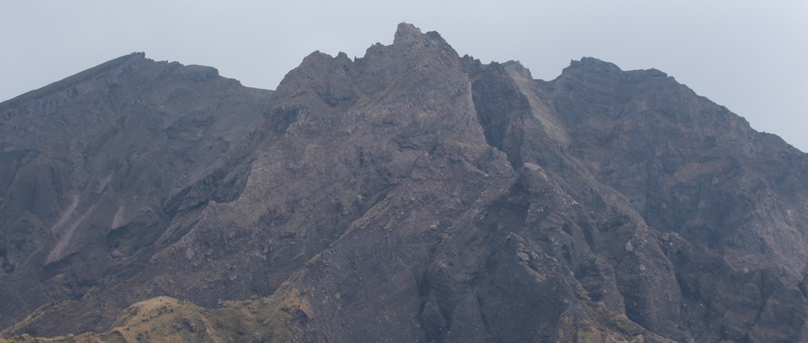

素晴らしい日々よ感謝してまだまだいける

So here I am, in a new city in a (not so) new land, starting off my 1 year of exchange in Kagoshima University. This past week has been really busy. I can tell you guys, settling down in Japan is much harder then in Australia. Japan sure loves its bureaucracy, but I did manage to have fun with new made friends and I am sure that I will have even more fun from now on.

<!--more-->So basically this week I had to:

- Check-in to my accommodation
- Get a Japanese seal (inkan) for official documents
- Get a residents card and register my current address in Japan.
- Apply for health insurance and get the health insurance card.
- Meet the professor who is in charge of the laboratory that I have been assigned to (I don't have to do any research for the lab though)
- Get my student ID card from Kagoshima University
- Open a bank account in Kagoshima Bank (and get a credit card, which i had to specifically request)
- Buy a bicycle (photos bellow)
- Buy all the necessary things for home; like: microwave, cattle, toaster, rice cooker, monitor (for PS3 and Mac Mini) a few bits of furniture, groceries and other stuff. (no photos of room yet, will post up soon)
- Attend a language assessment test (placement test) to determine which level of japanese classes will I be taking (advanced O.o)
- Attend an orientation session for all international students
- Enroll into non Japanese language classes (in my case programming classes)
- Meet with the subject coordinators/lecturers to get their approval for my enrollment
- Attend an orientation at the dorm for new residents in japan

Yes, that was a long list. I also attended 2 parties with the other exchange/international students and 1 party (flower viewing) with the people from my lab (who are mostly into anime, which is good). This whole week was full of experiences, which I am sure I will remember for the rest of my life, and thats awesome!

There are still 2 very important things I need to do this week. One of them deeply relies on how fast the bank can get me my credit card. If I get it this week, then I can finally put that credit card into Amazon.co.jp and order myself a pre-paid phone sim from [b-mobile](http://www.bmobile.ne.jp). If not this week then next.

Also yesterday we went to the beach to celebrate a birthday of a certain German guy named Calvin. He is an awesome guy and a very helpful sempai! Thats why I want to wish you all the best with your studies and personal life in the future; keep smiling Calvin! Photos from the event are in [this flickr album/set](https://www.flickr.com/photos/jamiejakov/sets/72157643692781984/).

Overall I have been having a lot of fun and I am looking forward to starting classes tomorrow (honestly I am). As always, I have photos here:

